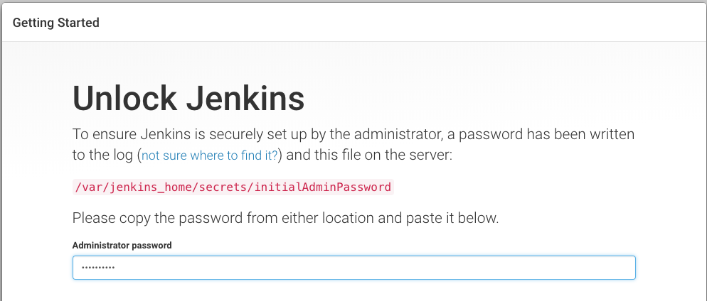

helmを使用する事前の設定をします。
helmの初期化、RBACの設定を実施します。 ::

    $ helm init
    $ kubectl create clusterrolebinding add-on-cluster-admin --clusterrole=cluster-admin --serviceaccount=kube-system:default

基本的なhelmの使い方は以下の通りです。 ::

    $ helm install stable/helm-chart名

今回はJenkinsを導入するにあたり環境に併せてカスタマイズを行います。
Helmは以下のURLに様々なものが公開されています。パラメータを与えることである程度カスタマイズし使用することができます。
Helm chartと同等のディレクトリにvalues.yamlというファイルが存在し、これを環境に併せて変更することでカスタマイズしデプロイできます。

* https://github.com/kubernetes/charts

今回のJenkinsのデプロイでは、Ingressを使った公開をするため「Master.Ingress.Annotations」、「Master.ServiceType」を変更してデプロイしています。
また、このvalues.yamlでは永続化ストレージが定義されていないため、Level2で作成したStorageClassを使用し動的にプロビジョニングをするように変更しましょう。

.. literalinclude:: resources/helm-values/jenkins-default-values.yaml
        :language: yaml
        :caption: Helm設定用のvalues.yaml

実行イメージとしては以下の通りです。 ::

    $ helm --namespace jenkins --name jenkins -f ./jenkins-values.yaml install stable/jenkins

    NAME:   jenkins
    LAST DEPLOYED: Mon Mar 26 19:57:25 2018
    NAMESPACE: jenkins
    STATUS: DEPLOYED

    RESOURCES:
    ==> v1/PersistentVolumeClaim
    NAME     STATUS   VOLUME  CAPACITY  ACCESS MODES  STORAGECLASS  AGE
    jenkins  Pending  0s

    ==> v1/Service
    NAME           TYPE          CLUSTER-IP     EXTERNAL-IP  PORT(S)         AGE
    jenkins-agent  ClusterIP     10.100.198.44  <none>       50000/TCP       0s
    jenkins        LoadBalancer  10.101.141.43  <pending>    8080:31340/TCP  0s

    ==> v1beta1/Deployment
    NAME     DESIRED  CURRENT  UP-TO-DATE  AVAILABLE  AGE
    jenkins  1        1        1           0          0s

    ==> v1/Pod(related)
    NAME                      READY  STATUS    RESTARTS  AGE
    jenkins-6cd96444b5-z9ctq  0/1    Init:0/1  0         0s

    ==> v1/Secret
    NAME     TYPE    DATA  AGE
    jenkins  Opaque  2     0s

    ==> v1/ConfigMap
    NAME           DATA  AGE
    jenkins        3     0s
    jenkins-tests  1     0s

    NOTES:
    1. Get your 'admin' user password by running:
      printf $(kubectl get secret --namespace jenkins jenkins -o jsonpath="{.data.jenkins-admin-password}" | base64 --decode);echo
    2. Get the Jenkins URL to visit by running these commands in the same shell:
      NOTE: It may take a few minutes for the LoadBalancer IP to be available.
            You can watch the status of by running 'kubectl get svc --namespace jenkins -w jenkins'
      export SERVICE_IP=$(kubectl get svc --namespace jenkins jenkins --template "{{ range (index .status.loadBalancer.ingress 0) }}{{ . }}{{ end }}")
      echo http://$SERVICE_IP:8080/login

    3. Login with the password from step 1 and the username: admin

    For more information on running Jenkins on Kubernetes, visit:
    https://cloud.google.com/solutions/jenkins-on-container-engine

        1. Get your 'admin' user password by running:
          printf $(kubectl get secret --namespace jenkins jenkins -o jsonpath="{.data.jenkins-admin-password}" | base64 --decode);echo
        2. Get the Jenkins URL to visit by running these commands in the same shell:
          export POD_NAME=$(kubectl get pods --namespace jenkins -l "component=jenkins-master" -o jsonpath="{.items[0].metadata.name}")
          echo http://127.0.0.1:8080
          kubectl port-forward $POD_NAME 8080:8080

        3. Login with the password from step 1 and the username: admin

「NOTES」欄に記載の通りadminパスワードを取得します。

一部自身で対応する部分があります。
component部分はnamespaceを指定している場合はメッセージとは変更になりますので留意ください(2018/4時点) ::

        $ export POD_NAME=$(kubectl get pods --namespace jenkins -l "component=jenkins-jenkins-master" -o jsonpath="{.items[0].metadata.name}")
        $ echo $POD_NAME
           jenkins-6d9c5bffdc-mzk8x

初期画面に記載されている通りパスワードを取得します。 ::

    $ kubectl exec -it jenkins-jenkins-d487b4c48-gg57j -- cat /var/jenkins_home/secrets/initialAdminPassword
      60dedec9310c4d72a9d59f6d0b283a4a
