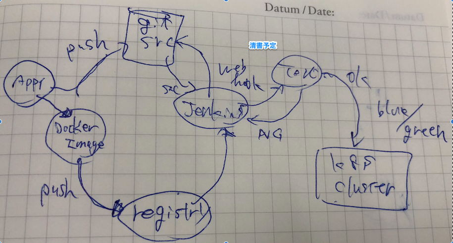

==============================================================
Level 3: CI／CDパイプラインを構築
==============================================================

本ラボでは Level1, Level2 で行ったオペレーションをベースにCI/CD パイプラインを構築します。
このシナリオではGitにソースがコミットされたら自動でテスト・ビルドを実現するためのツール(Jenkins)をkubernetes上へデプロイ、及び外部公開をします。
そして、ツールがととのったら実際にアプリケーションの変更を行い自動でデプロイするところまでを目指します。

このレベルで習得できるもの
=============================================================

* アプリケーションをコンテナ化後に自動テスト、自動デプロイできるようにする
* CI/CDパイプラインを作成する
* 副次的にHelmの使い方を習得

実現したいこと
=============================================================

このラボでのCI/CDパイプラインの定義は以下を想定しています。

* テスト実行
* アプリケーションビルド
* コンテナイメージのビルド
* レジストリへコンテナイメージのpush
* アプリケーションデプロイ

Gitは共有で準備しています。

ここではJenkinsをkubernetes上にデプロイしてみましょう。
Git自体も併せてデプロイしてみたいということであればGitLabをデプロイすることをおすすめします。
GitLabを使えばコンテナのCI/CDパイプライン、構成管理、イメージレジストリを兼ねて使用することができます。

Jenkinsのデプロイ
=============================================================

CI/CDパイプラインを実現するためのツールとしてJenkinsが非常に有名であることは周知の事実です。
このラボではJenkinsを使用しCI/CDを実現します。

まずは、各自Jenkinsをデプロイします。

方法としては3つ存在します。

#. Helm Chartでデプロイする方法 (手軽にインストールしたい人向け)
#. Level1,2と同じようにyamlファイルを作成し、デプロイする方法(仕組みをより深く知りたい人向け)
#. Kubernetes用にCI/CDを提供するJenkins Xをデプロイする方法(新しい物を使いたい人向け)

今回は最初のHelmでデプロイするバージョンを記載しました。
好みのもの、学習したい内容に沿って選択してください。

また、今回はkubernetesクラスタ外のネットワークからアクセスできるようにIngressも作成します。
そのため、Jenkinsを作成する際にはJenkinsのService内のtypeはNodePort指定で作成をします。

オリジナルでyamlファイルを作成する場合は以下のサイトが参考になります。

    https://cloud.google.com/solutions/jenkins-on-kubernetes-engine

Helmでデプロイする場合
-------------------------------------------------------------

.. include:: helm-install.rst

以上で、Jenkinsのデプロイが完了しました。

Jenkinsを外部に公開する
=============================================================

Level1,2ではデプロイしたアプリケーションが配置されているノードのIPに対してアクセスして稼働を確認していました。
ここからは外部にアプリケーションを公開しアクセスする方法を使用します。

具体的にはServiceを定義する際に指定する「type」が複数提供されています。

#. ClusterIP
#. NodePort
#. LoadBalancer

- https://medium.com/@maniankara/kubernetes-tcp-load-balancer-service-on-premise-non-cloud-f85c9fd8f43c
- https://kubernetes.io/docs/concepts/services-networking/service/

今回はServiceのtypeをNodePortとして、Serviceの前段にIngressを配置する構成とします。
Ingressを使用してアプリケーションを外部に公開します。
IngressはL7ロードバランサーのような動きをします。

.. include:: ingress.rst

Jenkinsの設定をする
=============================================================

Gitリポジトリに変更があったら自動でテストを実行するジョブを定義します。
このテストは任意で作成してください。

ここでやりたいことは該当リポジトリにコミットがあり、リリースタグが付与された場合に自動でビルド・デプロイをする流れを作成することです。
そのためにはまずJenkins側でリポジトリに何か操作があった場合に動作をすることを定義します。

定義出来る動作としては以下の単位が考えられます。
細かく設定することも可能です。運用に合わせた単位で設定します。

* pull request 単位
* release tag 単位
* 定期実行

前述した以下の項目を盛り込みCI/CDパイプラインを作成しましょう。

* テスト実行
* アプリケーションビルド
* コンテナイメージのビルド
* レジストリへコンテナイメージのpush
* アプリケーションデプロイ

Jenkinsの一番まとまっている情報は本家のドキュメントです。

上記のようなパイプラインを作成にはJenkins pipeline機能を活用可能です。

-  https://jenkins.io/doc/book/pipeline/

アプリケーションの変更を検知してデプロイメント可能にする
=============================================================

CI/CDのパイプラインを作成したら実際アプリケーションの変更をトリガーに(ソースコードの変更、Gitリポジトリへのpush等)デプロイします。

ポリシーとして大きく2つに別れます、参考までに以下に記載いたします。

* デプロイ可能な状態までにし、最後のデプロイメントは人が実施する（クリックするだけ）
* デプロイメントまでを完全自動化する

実際にkubernetes環境へのデプロイができたかの確認とアプリケーションが稼働しているかを確認します。

Helm ChartでCI/CD
=============================================================

個別のアプリケーションデプロイメントからHelm Chartを使ったデプロイメントに変更します。

作成したコンテナをHelm Chartを使ってデプロイするようにします。

Helm Chartの開発ガイドは以下のURLを確認ください。

https://docs.helm.sh/chart_template_guide/#the-chart-template-developer-s-guide

デプロイメントのさらなる進化
=============================================================

CI/CDプロセスを成熟させていくと常にリリース可能な状態となっていきます。
そのような状態になると本番環境へのデプロイを迅速にし、ダウンタイムを最小化するための方法が必要になってきます。
元々存在するプラクティスや考え方となりますがコンテナ技術、kubernetesのスケジューラー機能を使うことで今までの環境とくらべて実現がしやすくなっています。

Blue/Greenデプロイメント, Canary リリースというキーワードで紹介したいと思います。

.. tips::

    CDには２つの意味を含んでいるケースがあります。文脈に応じて見分けるか、どちらの意味か確認しましょう。

    * Continuous Deployment: 常にデプロイ可能なものを生成するまでを自動化する、最後のデプロイメントは手動で実施。
    * Continuous Delivery: 本番環境へのデプロイメントまでを自動化する。

Blue/Greenデプロイメント
-------------------------------------------------------------

従来のやり方では1つの環境にデプロイし何かあれば戻すという方法をほとんどのケースで採用していたかと思いますが、さらなる進化として常に戻せる環境を準備し迅速にロールバック
新バージョン、旧バージョンをデプロイしたままルータで切り替えるようになります。

様々な企業で行き着いている運用でもあるかと思いますが、2010年にBlueGreenデプロイメントという名称で説明しています。

- https://martinfowler.com/bliki/BlueGreenDeployment.html

実現方法、切り替えのタイミングなどあり、BlueGreenの実装の決定的なものはなく、1つのプラクティスとして存在しています。

2つの環境を準備し、どこかのタイミングで切り替えを行うためDBのマイグレーションの方法などを検討する必要はでてきます。

Canary
-------------------------------------------------------------

Canary リリースは BlueGreen デプロイメントと類似したデプロイメントになります。
Blue／Green デプロイメントはすぐに古いバージョンにもどせるように仕組みを整えたものですが、Canaryリリースは新しいバージョン、旧バージョンにアクセスする比率を決めてデプロイするプラクティスです。

こちらは2つの環境ではなく、1環境に複数バージョンのアプリケーションが存在することになります。そのためDBのデータをどのように取り扱うかは検討が必要となります。

まとめ
=============================================================

このラボではコンテナ化したアプリケーションのCI/CDパイプラインの構築に挑戦しました。
CI/CDパイプラインを作成するためのJenkins/GitLabをインストールするために必要なHelmの使い方、アプリケーションを外部に公開するためのkubernetesオブジェクトのIngressも併せて使えるようになりました。

ここまでで Level3 は終了です。
