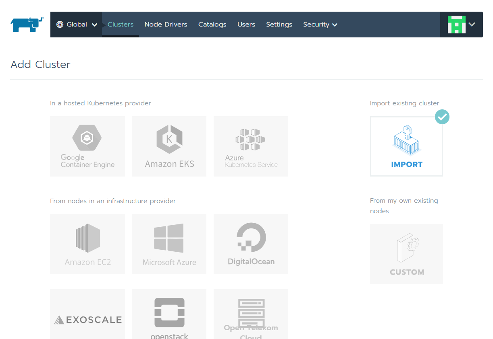
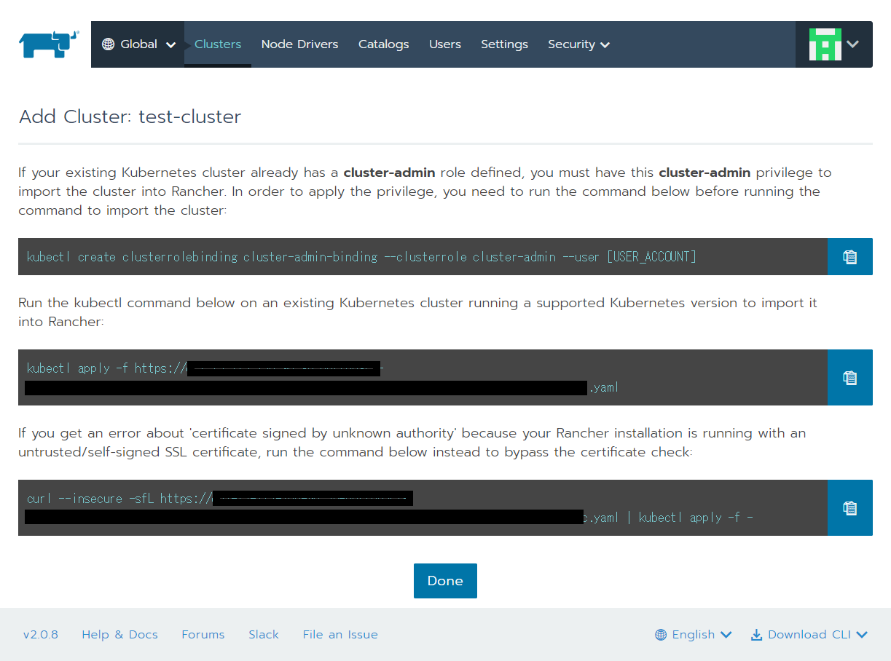

Rancher でできること
------------------------

Rancherは様々な環境のkubernetesクラスタを管理するとともに、アプリケーションの管理も行うことができます。

ここではRancherの導入から、アプリケーションのデプロイまでを簡単に実施します。

ここでいうアプリケーションとは kubernetes 上で動くものすべてです。

例えば、kubernetes クラスタを監視するソフトウェアスタック(Prometheus+Grafana+InfluxDB）をkubernetes上で簡単に起動することが可能です。

Rancher を導入する
------------------------

dockerをインストールする
^^^^^^^^^^^^^^^^^^^^^^

Rancherの導入には、Dockerコマンドを利用します。もし、Dockerをインストールしていない場合にはDockerをインストールします。

Rancherに必要なDockerのバージョンは、以下のURLに書いてあります。
https://rancher.com/docs/rancher/v2.x/en/installation/requirements/

* 1.12.6
* 1.13.1
* 17.03.2
となっていますが、18.06.01 でも動いています。今回は、18.06を使います。

インストール方法は、

.. code-block:: none 

  curl https://releases.rancher.com/install-docker/18.06.sh | sh

でインストールしてください。

Rancherをインストールする
^^^^^^^^^^^^^^^^^^^^^^^

次にRancherをインストールします。

以下のDockerHubのタグでv2.x系の最新のバージョンを確認してください。。

  https://hub.docker.com/r/rancher/rancher/tags/

今回は、v2.0.8 をインストールします。

.. code-block:: none 

    docker run -d --restart=unless-stopped \
    -p 80:80 -p 443:443 \
    rancher/rancher:v2.0.8

Rancher へログイン
-----------------

上記のRancherをインストールしたホストのIPアドレスでブラウザーを開くと以下のような画面が表示されます。

.. image:: resources/login.png

パスワードを指定するか、ランダムのパスワードを生成して **Continue** を押します。

Kubernetes クラスターのインポート
----------------------

次に、作っておいた Kubernetesクラスターを Rancherから認識できるようにインポートします。
Globalから **Add Cluster** ボタンを押します。

.. image:: resources/Add-Cluster-Dashboard.png

クラスター追加画面が出てきますが、右上の **IMPORT** ボタンを押します。

次に、Cluster Nameを指定して **Create** ボタンを押します(Memberは自分一人で使う分には追加する必要はありません)。

.. image:: resources/Set-ClusterName.png

以下のページで表示されたコマンドを実行します。
kubectlコマンドは事前にインストールし、kubernetesに接続できるよう設定しておいてください。

.. code-block:: none

    kubectl create clusterrolebinding cluster-admin-binding --clusterrole cluster-admin --user [USER_ACCOUNT]

上記の [USER_ACCOUNT] は上記コマンドを実行するユーザーIDを指定します。

.. code-block:: none

    kubectl apply -f https://xxxxxxxxxxxxxx.com/v3/import/XXXXXXXXXXXXXXXXXXXXXXXXX.yaml

上記のコマンドで証明書の問題のエラーが発生する場合は、以下のコマンドを実行して下さい。

.. code-block:: none

    curl --insecure -sfL https://xxxxxxxxxxxxxx.com/v3/import/XXXXXXXXXXXXXXXXXXXXXXXXX.yaml | kubectl apply -f -

アプリケーションをデプロイ
------------------------

Prometheus+Grafanaのデプロイ

^^^^^^^^^^^^^^^^^^^^^^^^^^^

