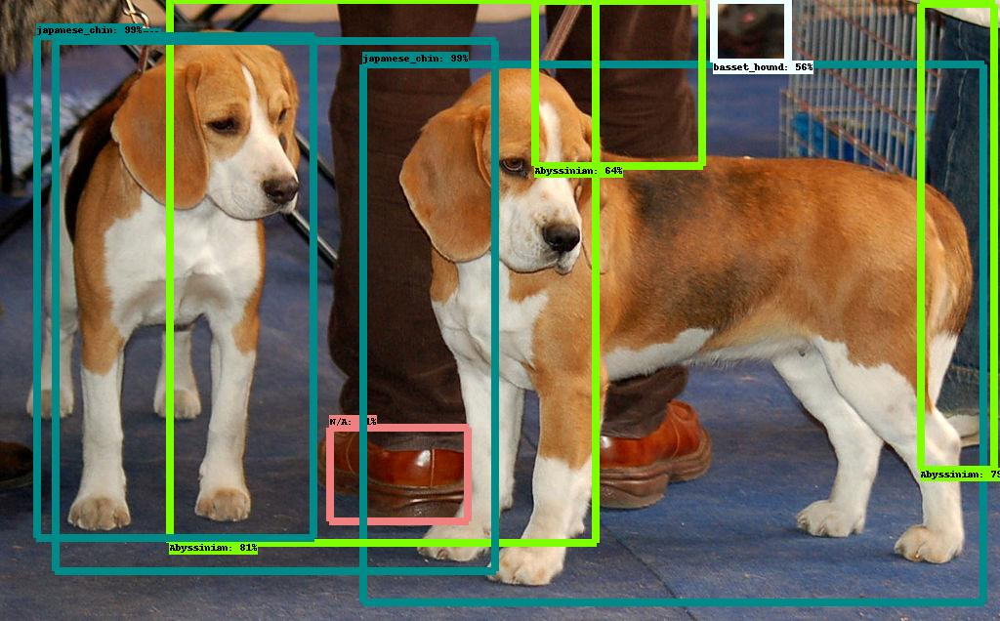

=============================================================
実践編: はじめに
=============================================================

概要
=============================================================

Kubernetes上でAIアプリケーションを作成するハンズオンです。
まずは一連の流れを体験することが目的です。

ハンズオンの流れ
=============================================================

* 当日の環境確認
* ハンズオンを行うための環境構築
* トレーニングデータの準備
* サンプルの学習コードを使ってモデル作成
* アプリケーションから利用するためのモデルを生成
* 生成したモデルを生成し、クライアントから呼び出し、推論を行う

ゴール・目的
=============================================================

基本コース
--------------------------------------------------------------

Kubernetes環境下でAIアプリケーションのデプロイまでの１連の流れを体験する。

- データの取得から、データ準備、トレーニング、サーブまでを体験

最終的なアウトプットとしては以下のように、物体に写真の中の物体にマーキングされた画像を出力するのがゴールです。

オプション
--------------------------------------------------------------

環境・リソースに限りがあるため終わった方で試したい方はお伝えください。

- オプションでフローの中を更に高速化
    - GPUを活用し演算の高速化を体験
    - KubeflowのコンポーネントであるArogo CI を使い自動化を体験
- メインはオンプレの環境を使用しましたが、これがクラウドでもアーキテクチャの変更なしに同じことができることを体験する。
