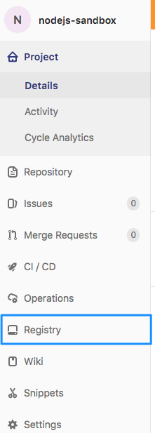

==============================================================
Level 1: アプリケーションをコンテナ化する
==============================================================

目的・ゴール: アプリケーションをコンテナ化する
=============================================================

今回はコンテナに適したアーキテクチャへ変更するまえの段階として、
オンプレミスで仮想マシンで動いているアプリケーションについてコンテナ化をしていきます。

コンテナ技術のDockerを使うことでクラウド、オンプレミス、PCなどどのような環境でもアプリケーションを稼働させることができます。

具体的にはコンテナイメージをpullし、実行します。 その結果、アプリケーションがコンテナとして起動します。

このレベルではこのあとのラボで使用するKubernetes上で稼働させるアプリケーションのコンテナイメージを作成するのがの目標です。

流れ
=============================================================

#. Dockerfileを作成する。
#. ビルドを行いDockerイメージを作成
#. 作成したDockerイメージをDocker Registryに登録
#. どこからでもpull可能に（デプロイが可能に）

コンテナ化の準備
=============================================================

本ラボでは以下のミドルウェアやスタックを使ったアプリケーションを想定しています。
基本的にはアプリケーションをコンテナ化する際にはDockerHubで作成済みのイメージを使用することで効率よくコンテナ化することができます。

Web/AP レイヤー

* nginx
* apache
* tomcat

Databaseレイヤー

* mySQL
* Postgress
* Oracle
* MongoDB

コンテナイメージの作成
=============================================================

.. raw:: html

    
        このステップはアプリケーションを持ち込みの場合や複雑なスタックをコンテナ化する際に行うステップです。 
        選択したアプリケーションによっては不要なステップになるのでやるべきかどうかを確認してください。
    

その場合、 :ref:`deploywithmanifest` からはじめてください。

想定するアプリケーションのコンテナイメージを作成します。

Dockerfile のリファレンス `Dockerfile Reference ファイル <https://docs.docker.com/engine/reference/builder/>`_

留意点としては以下の通りです。

* アプリケーションの配置をDockerfile内に配置
* 基本となるコンテナイメージについてはDockerHubで探してベースイメージとする
* 静的な構成となっていないか(IPパスワードのべた書きなど)

    * 環境変数で設定出来るよう設計する。のちほどk8sのSecretなどでパスワードを保存

* 冪等性はコンテナイメージ側で対応する。責任範囲を明確にしてイメージを作成
* ステートフルなものについてはコンテナに適したものにする

    * データ永続化については :doc:`../Level2/index` にて実施

.. hint::

    記述例を提示します。このままビルドしてもイメージは作成されませんのであくまで記述例としてみてください。
    どうしても進まない場合は :doc:`resources/level1_sampledockerfile`  をクリックしてください。

コンテナイメージのビルド
=============================================================

作成した Dockerfileをビルドしてイメージを作成します。

バージョニングを意識してコンテナイメージを作成します、コンテナイメージに明示的にバージョンを指定します。

.. code-block:: console

    $ docker build -t 生成するコンテナイメージ名:タグ名 Dockerファイルのパス

Dockerイメージの生成方法は複数の手法があります。
例えば、普通のOSイメージを起動して、ログインしパッケージなどのインストールを行っていく手法があります。
メリットとしてはオペレーションで作成したものをイメージとして登録できるため、Dockerfileを作成しなくても良いといメリットがある一方で、
コンテナイメージの作成方法が不透明となる可能性もあります。

イメージレポジトリに登録
=============================================================

プライベートレジストリ、DockerHubは選択いただけます。
このラボで作成したイメージを自社などで再利用したい場合はDockerHubにpushすることもできます。

DockerHub へログイン
-------------------------------------------------------------

DockerHubにアカウントがあることが前提です。

.. code-block:: console

    $ docker login

      ユーザ名、パスワードを入力

    $ docker image push アカウント名/コンテナイメージ名:タグ名

Private registry (GitLab) を使う場合
-------------------------------------------------------------

private registry を使う場合はGitLabへログインし、プロジェクトを作成します。

GitLab URL: http://gitlab.gitlab.ndxlab.net

プロジェクトを作成するとコンテナイメージのレジストリも使用できるようになります。

Dockerfileを含んだソースをgitリポジトリにpushすると自動で以下のようなビルド、レジストリへのpushの手順が提示されます。
プライベートレジストリのURLも手順内に記載されます。

.. image:: resources/gitlab_docker_push.png

Dockerイメージのビルド、pushのサンプルは以下の通りです。

 .. code-block:: console

    $ docker build -t レジストリURL/アカウント名/コンテナイメージ名:タグ名
    $ docker push レジストリURL/アカウント名/コンテナイメージ名:タグ名

.. _deploywithmanifest:

アプリケーションのマニフェストファイルを作成してデプロイ
=============================================================

:doc:`../Level0/index` ではコマンドラインで作成してきましたがYAMLファイルで１サービスをまとめてデプロイ出来るようにします。

ファイルのセクション構成としては以下の通りです。

* Service
* PersistentVolumeClaim
* Deployment

サンプルファイルを準備しましたのでそれぞれの項目の意味を考え作成してみましょう。

.. todo:: シンプルなマニフェストファイルとする。

(https://kubernetes.io/docs/tutorials/stateful-application/mysql-wordpress-persistent-volume/ を参考としています。）

ここではサンプルとしてWordPressとMySQLをデプロイします。
MySQLではSecretオブジェクトを使用しパスワードを渡すようになっています。

流れとしては、以下の3つを実施します。

どの部分を実施しているかを把握しながらすすめましょう。

1. MySQL 用のSecretオブジェクトを作成
2. MySQL をデプロイ
3. WordPressをデプロイ

Secretの作成
-------------------

ここではKubernetes上でパスワードを受け渡すときなどに使う、Secretを作成します。

Secretの説明はこちらです。

- https://kubernetes.io/docs/concepts/configuration/secret/

.. code-block:: console

    $ kubectl create secret generic mysql-pass --from-literal=password=YOUR_PASSWORD

作成後は以下のコマンドで結果を確認します。

.. code-block:: console

    $ kubectl get secrets

         NAME                  TYPE                    DATA      AGE
          mysql-pass            Opaque                  1         42s

MySQLのデプロイ
-------------------

``mysql-pass`` という名前でSecretができたのでそのSecretを使ってMySQLを起動します。

.. literalinclude:: resources/sample-mysql-deployment.yaml
    :language: yaml
    :caption: アプリケーションをデプロイするマニフェストファイルの例 mysql-deployment.yaml

上記のマニフェストをもとにDeploymentを作成します。

.. code-block:: console

    kubectl create -f mysql-deployment.yaml

少々時間がかかるのでどのように状態が移って行くか確認し、「Status」が「Running」になることを確認してください。

.. code-block:: console

      $ kubectl get pods

      NAME                               READY     STATUS    RESTARTS   AGE
      wordpress-mysql-1894417608-x5dzt   1/1       Running   0          40s

WordPressのデプロイ
-----------------------------

MySQLのコンテナが立ち上がったらそのMySQLに接続するWordPressをデプロイします。

.. literalinclude:: resources/sample-wordpress-deployment.yaml
    :language: yaml
    :caption: アプリケーションをデプロイするマニフェストファイルの例 wordpress-deployment.yaml

MySQLと同様にデプロイします。

.. code-block:: console

    kubectl create -f wordpress-deployment.yaml

.. sidebar:: 本番運用に関して

    :doc:`../Level4/index` にてシングル構成ではなく本番運用する際の考慮点等をまとめました。
    Workload APIを使う方法で可用性を高めることができます。

kubectlの操作を容易にする
-------------------------------------------------------------

上記のマニフェストにも記載がありますが、Labelには複数の使い方があります。
Serviceが接続先を見つけるために使っている例が上記のマニフェストとなります。

* 参考URL: `k8s label <https://kubernetes.io/docs/concepts/configuration/overview/#using-labels>`_

kubectlのオペレーションの簡易化のためlabelをつけることをおすすめします。
例えば以下のような使い方があります。

``kubectl get pods -l app=nginx`` などのようにlabelがついているPod一覧を取得といったことが簡単にできます。
ほかにも以下の様なことが可能となります。

* ``kubectl delete deployment -l app=app_label``
* ``kubectl delete service -l app=app_label``
* ``kubectl delete pvc -l app=wordpress``

アプリケーションの稼働確認
=============================================================

デプロイしたアプリケーションにアクセスし正常稼働しているか確認します。

アクセスするIPについてはサービスを取得して確認します。

.. code-block:: console

    $ kubectl get svc

結果として以下のような出力が得られます。

今回はService.typeをLoadBalancerで指定しているため、EXTERNAL-IP欄に表示されたIPでアクセスしてみましょう。

.. code-block:: console

    NAME              TYPE        CLUSTER-IP     EXTERNAL-IP   PORT(S)        AGE
    kubernetes        ClusterIP   10.96.0.1      <none>        443/TCP        6d
    wordpress         LoadBalancer    10.98.247.58   192.168.10.210        80:32048/TCP   2h
    wordpress-mysql   ClusterIP   None           <none>        3306/TCP       2h

* 今回はオンプレミスでMetalLBを使用しLoadBalancerでExternal-IPを使用できるようにしました。

Service.Type=NodePortについても確認しましょう。

- 参考URL: https://kubernetes.io/docs/concepts/services-networking/service/#publishing-services-service-types

.. note:: kubectl引数の省略系について

    今回はServiceの確認をする際に ``svc`` という省略形でコマンドを実行しました。
    他のオブジェクトも同様に省略形があります。コマンド入力を省力化したい場合は省略形も使ってみましょう。

    ``kubectl --help`` や ``kubectl XX --help`` コマンドで確認できます。

まとめ
=============================================================

kubectlやYAMLで記載するマニフェストファイルを使ってk8sへのデプロイが体感できたかと思います。
実運用になるとこのYAMLをたくさん書くことは負荷になることもあるかもしれません.

その解決のためにパッケージマネージャーHelm 等を使ってデプロイすることが多いかと思います。
このラボでは仕組みを理解していただき、応用出来ることを目的としています。

ここまでで Level1 は終了です。