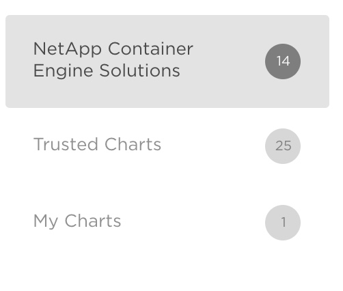
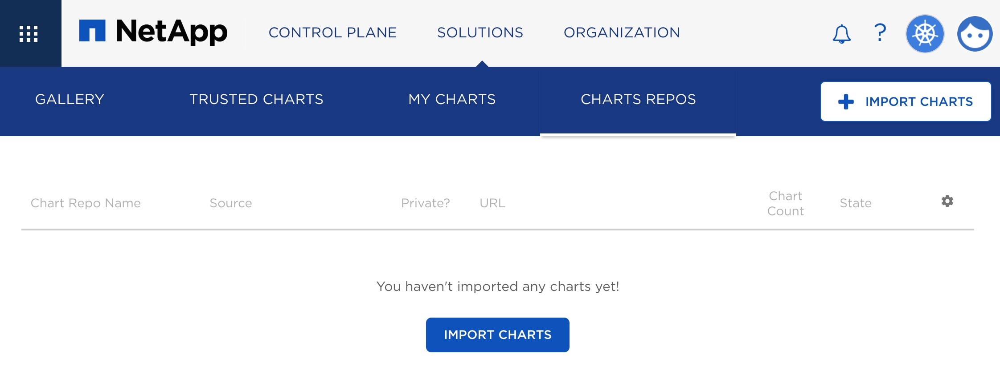
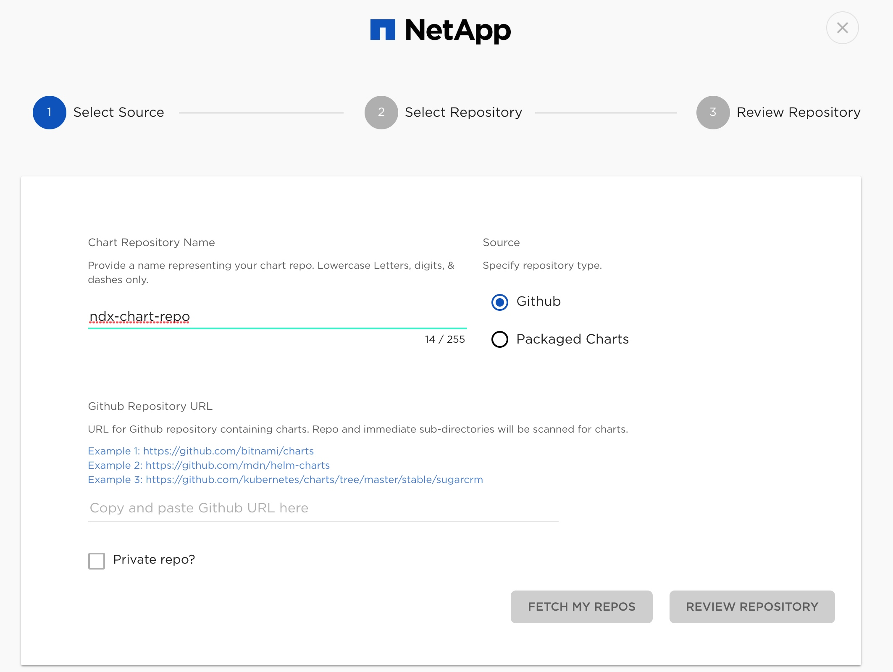
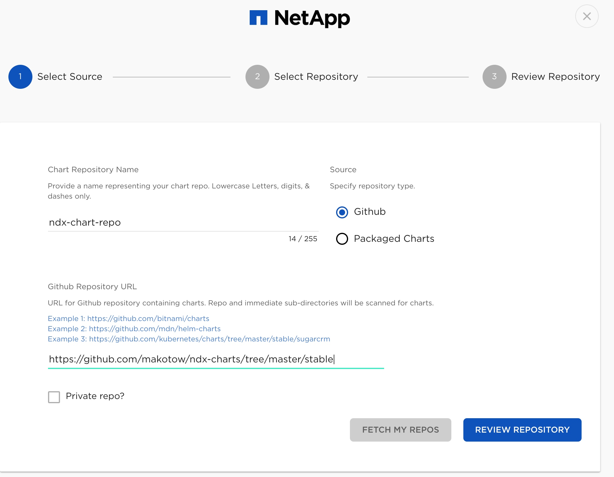
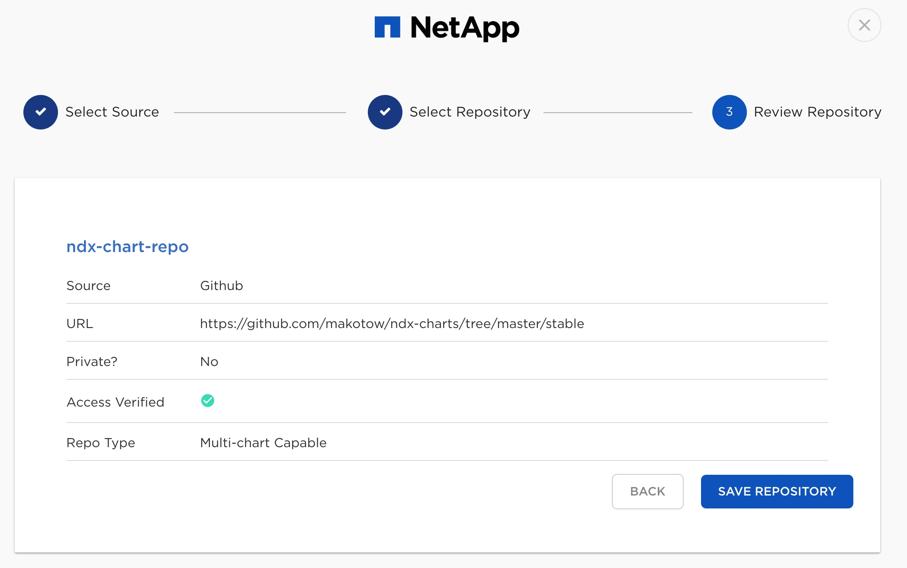
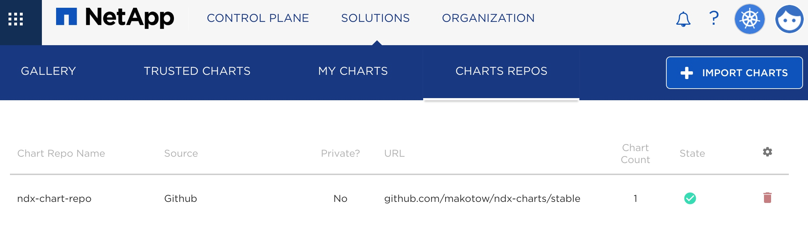
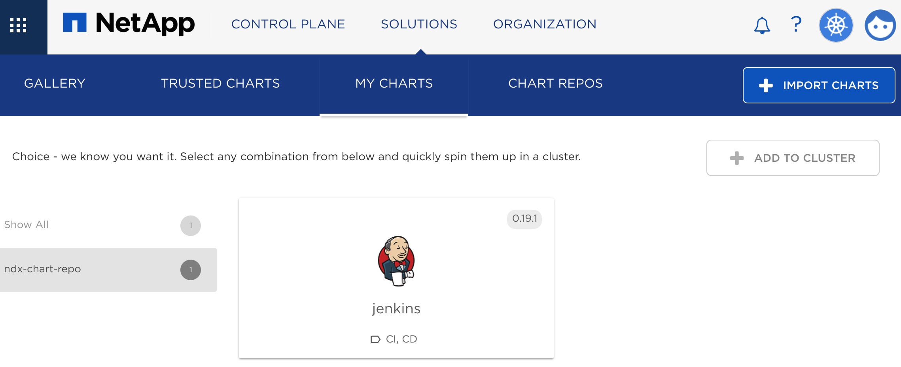

========================================================================
NetApp Kubernetes Service: アプリケーションの管理 Helm Chart
========================================================================

NKSではSolutionsというよく使われるものをすぐにクラスタにデプロイできるようカタログ化して提供しています。

もちろん自身のアプリケーションを登録することもできます。

本章ではSolutionsに自身のアプリケーションリポジトリをインポートする方法を紹介します。

概要
========================================================================
Solutionsにはいくつかのカテゴリがあり、以下の３つが提供されています。

1. NetApp  Container Engine Solutions
2. Trusted Charts
3. MyCharts

1 に関してはNetAppが提供しているSolution（k8sにデプロイするもの）です。
2, 3 については実体は Helm Chartsが定義されています。

2 についてはNetApp(StackPoint Cloudを買収）のGitHubリポジトリで公開・ホストされています。

3は自身で公開しているHelm ChartsをNKSへ取り組むことができる機能です。
今回のこの部分についてどうすれば登録できるかを説明していきます。

登録の方法
========================================================================

Helmのリポジトリの作り方通りに作ってリポジトリに公開すれば終わりです。
Multiple Repository とsingleがありますが必要に応じて作り方を変更します。

https://docs.helm.sh/developing_charts/

オペレーション
========================================================================

NKSの画面で 「Solutions」->「CHARTS REPOS」と遷移します。
すると以下の画面になります。

ここで右上の以下のアイコンをクリックします。

登録時には「Github Repository URL」に以下のURLを入れます。
ポイントはstableまで入れるところです。

- https://github.com/makotow/ndx-charts/tree/master/stable

URL 入力が「REVIEW REPOSITORY」をクリックします。

確認画面となるので「SAVE REPOSITORY」をクリックします。

少し待つと以下の画面となりインポート成功です。

MyChartにもJenkinsが登録されました。（自身のリポジトリにJenkinsを作った）

まとめ
========================================================================

自作Helmチャート、主に自身で作ったユーティリティやアプリケーションを登録することでNKSからデプロイ・管理することができるようになります。

Helm Chartの作り方をそのまま登録できます、既存のHelm Chartのカタログ化にも活用できるものです。
