========================================================================
NetApp Kubernetes Service: Backup/Restore with Heptio Ark
========================================================================

HeptioArkを使ったバックアップを体験します。

Heptio が VMWareに買収発表されたのが記憶に新しいですが、Kubernetesのバックアップツールとしてはデファクトのツールです。


バックアップ設定の基本オペレーション
========================================================================


NKSの画面から Heptio Ark をクリックすると以下の画面になります。

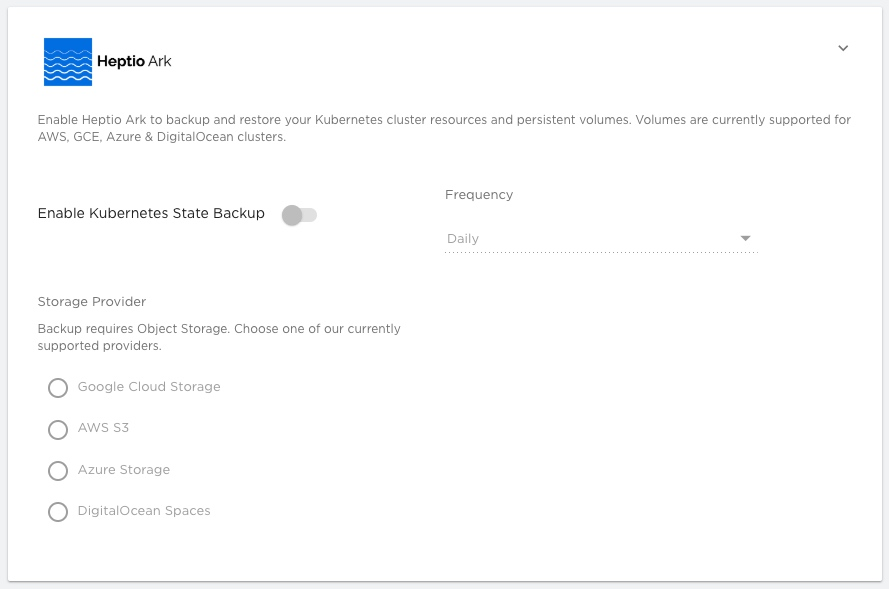

「Enable Kubernetes State Backup」をクリックしてバックアップを有効にします。

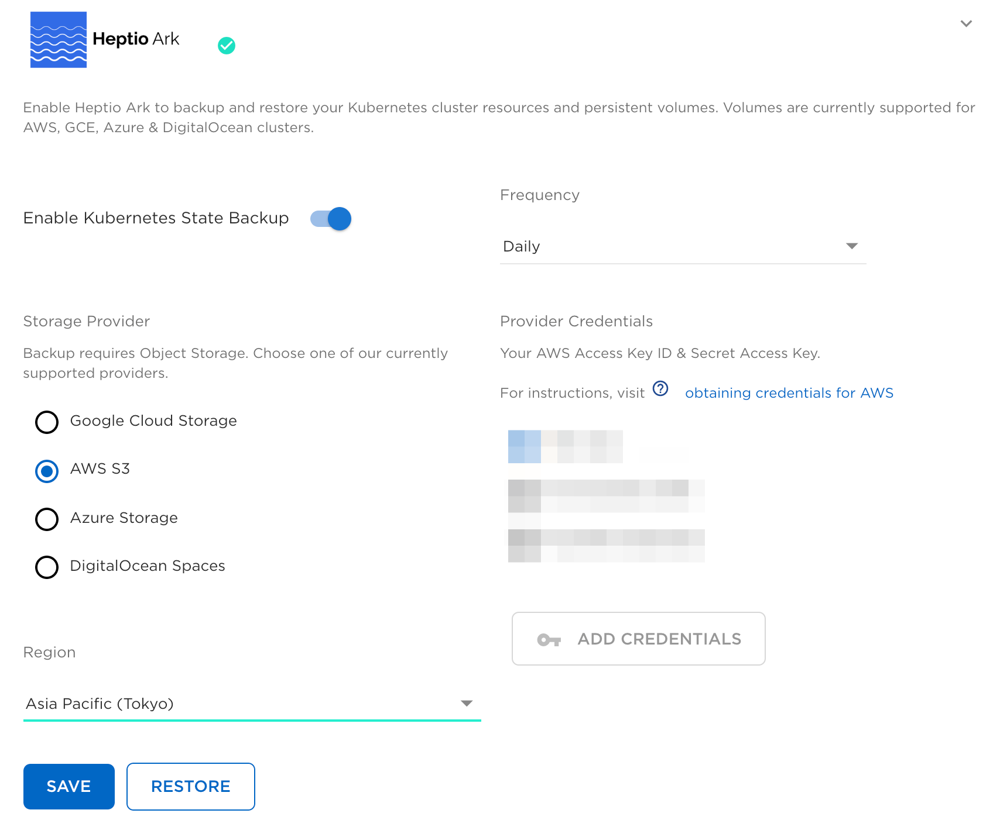

どこにバックアップを取得するかをで「AWS S3」を選んで、リージョンを選択します。
その後、Frequencyでバックアップする頻度を選択します。

S3バケットは自動で作成するため登録しているクレデンシャルがS3バケットの作成権限を持っていれば問題ありません。

その後画面下の「Save」ボタンを押すと以下のメッセージがポップアップ表示されます。

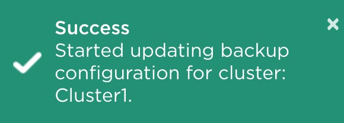

画面左のイベントログから今行った実行ログ
を確認します。

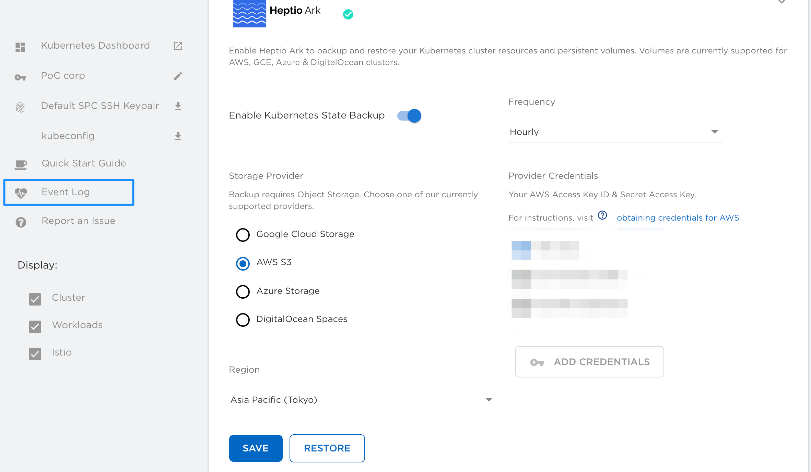

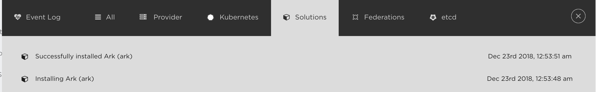

AWS S3を見てみる
========================================================================

Ark 設定後にAWS S3のコンソールからバケットの確認をします。

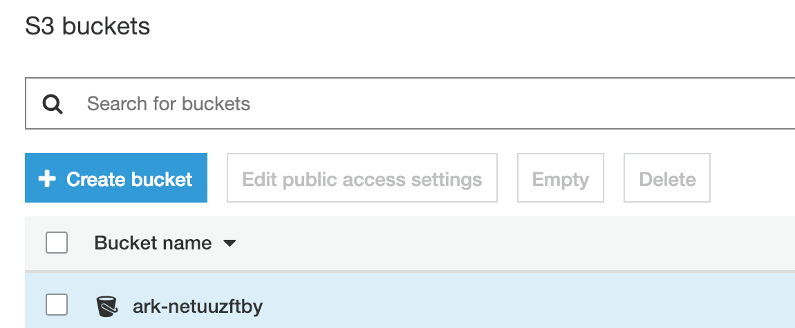

バケット名は ark+[クラスタの識別子] という形になっています。

更に中を見ていくと、初回起動のタイミングですでに１つバックアップが取得されています。

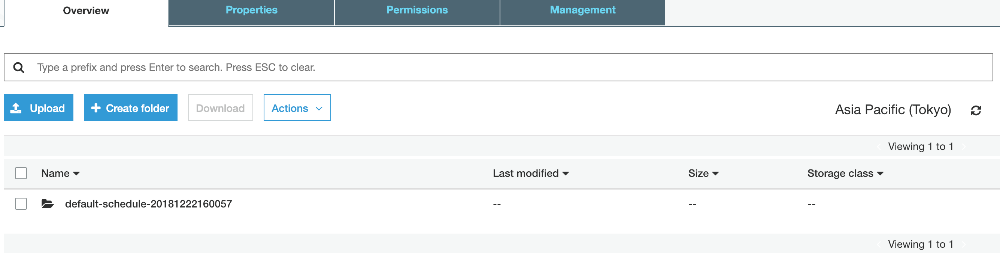

バケットの内容は以下の３ファイルです。

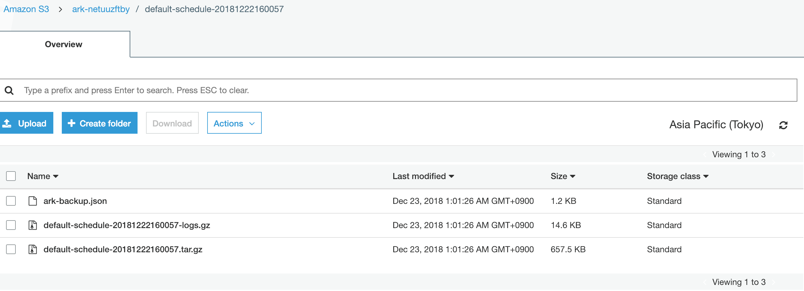

- ark-backup.json: Ark自体の構成情報
- default-schedule-20181222160057-logs.gz: バックアップのログ
- default-schedule-20181222160057.gz: k8sクラスタの構成情報の塊

ここまでで構成情報がバックアップされていることが確認できました。
時間が立てばこの単位でバックアップが取得されていきます。

現在のところリテンションポリシー的なものは設定できないのでどれくらい保管しておくかは別途確認になります。

リストアを実施する
========================================================================

現在クラスタにデプロイしているものは以下の通りです。


Jenkinsを削除します。

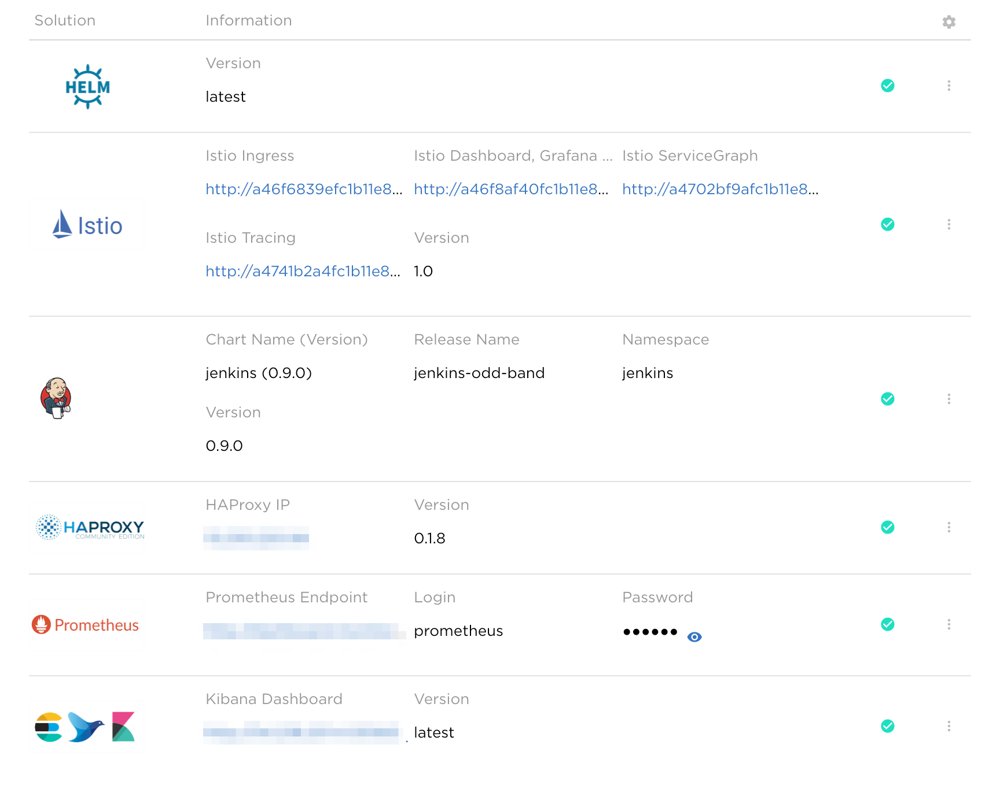

削除されたことを確認します。

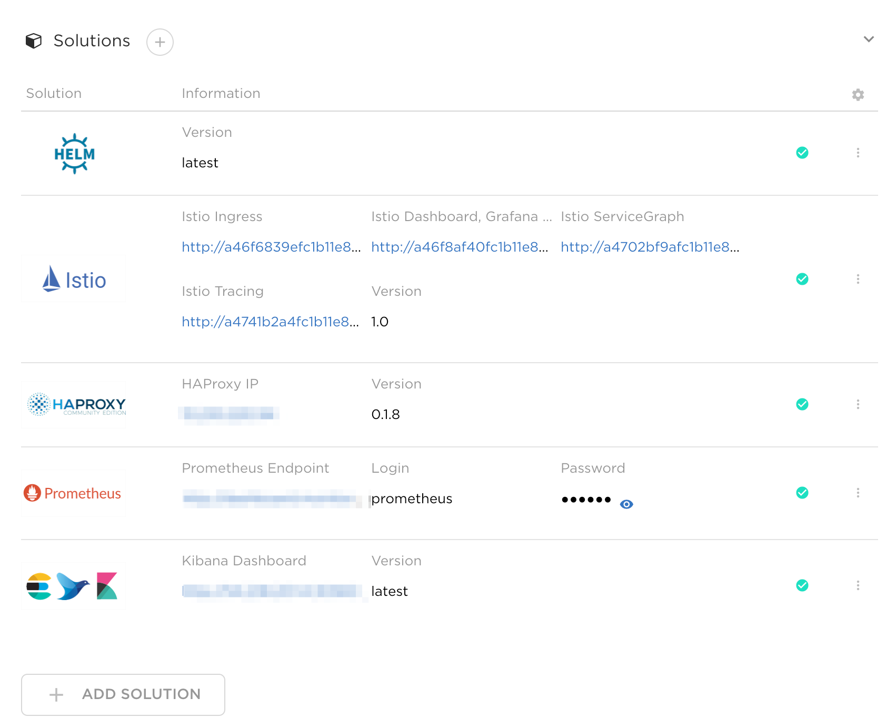

リストアすることでJenkinsがもとに戻ることを確認します。

リストアオペレーション
========================================================================

Ark から「RESTORE]ボタンをクリック。

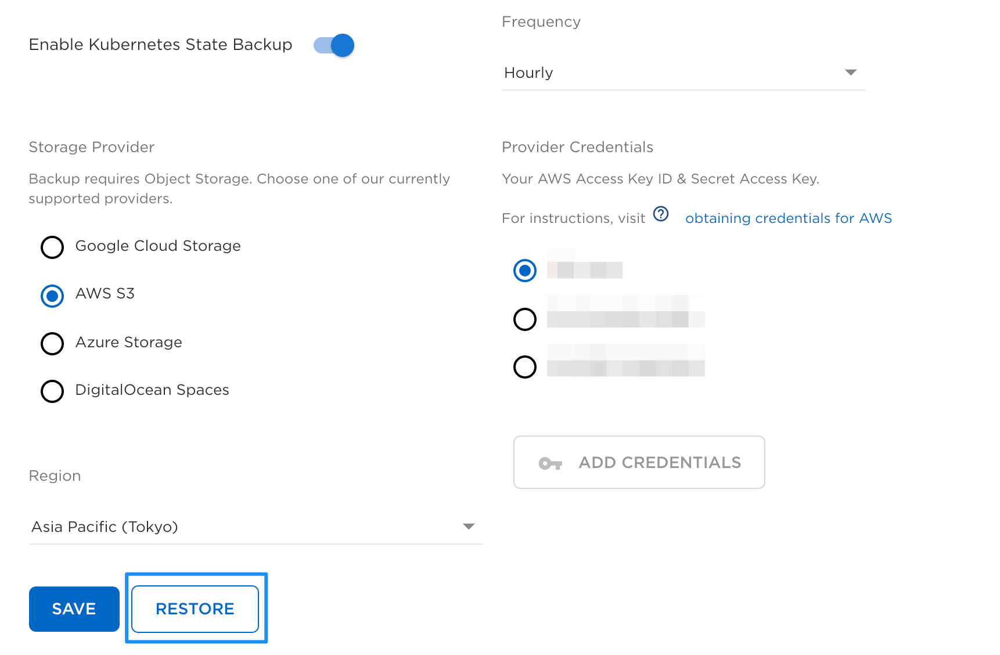

今までに取得されているバックアップ一覧が出てきます。

該当のバックアップを選択して、「RESTORE THIS BACKUP」をクリックして復元開始です。

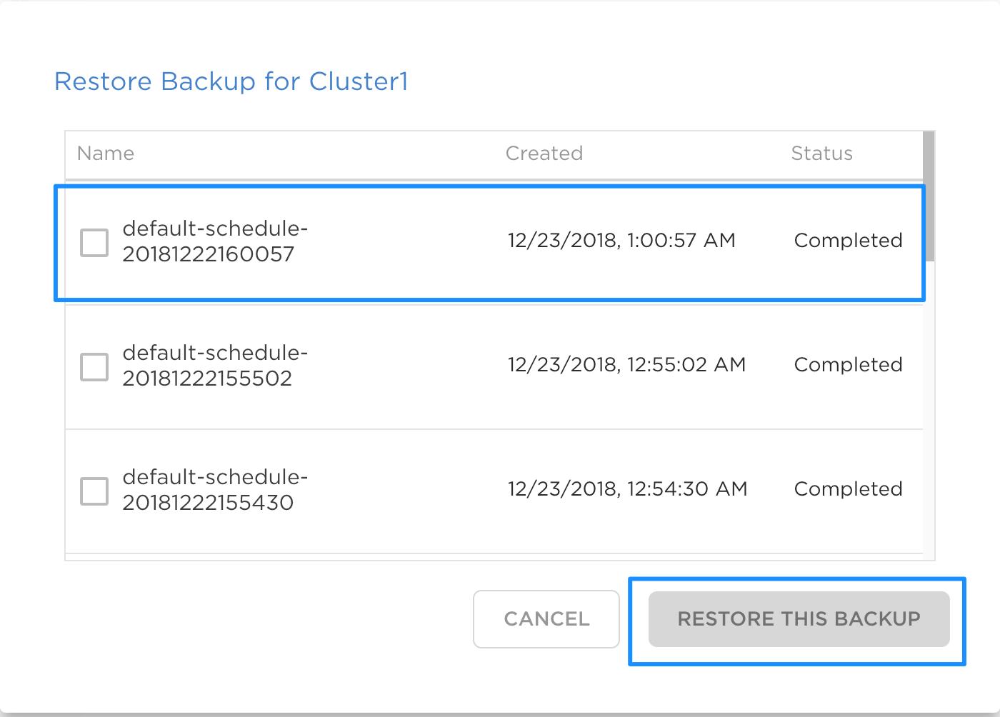

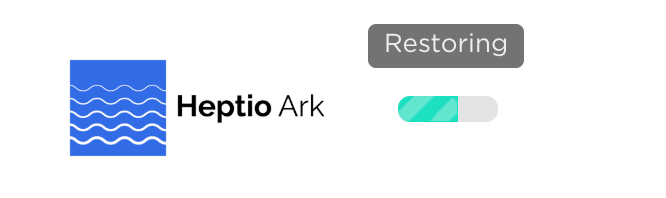

上記Solutionリストには戻りませんでしたが、Deploymentとしては復元できました。

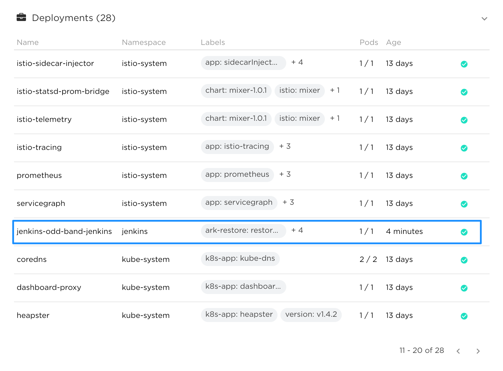

ただし、```service.type: LoadBalancer``` で実施している場合は新たにロードバランサーが作成されていましたので、DNSでCNAMEで名前解決をしている場合は付け直しになります。

今回は復旧できるかというところを見たため手動で設定し直しましたが、運用を考えるとこのあたりも自動化を検討すべきポイントです。

留意点・制約事項
========================================================================

リストアターゲット
-------------------------------------------------------------------------

バックアップ取得したクラスタへしか復元ができませんでした。
保管方法等をみてもHeptio Arkそのもののため、個別に ark クライアントを入れれば他のクラスタからもバックアップを参照し復元することができます。

ストレージリソースの検討
-------------------------------------------------------------------------

PVCのreclaimPolicyは障害が起きたところまでを考えて設定すべきです。
今回はJenkinsを題材にしましたがHelmから展開したタイミングでデフォルトのStorageClassを使用し、
reclaimPolicyをDeleteで設定していました。一旦削除した際にデータがすべて消えました。
今回はDeploymentのリストアの確認としています。PVCを含めたリストアをチャレンジしてみたください。

Heptioで構成情報を取得することで別環境でもクラスタを構成できます。
しかし、使っていたデータをどうもっていき、PV/PVCとして展開するかは検討する。

まとめ
========================================================================

本章ではNKSで提供しているHeptio ark 連携の具体的なオペレーション、バックアップ、リストア方法について記載しました。

Heptio Arkそのものを知っている方からすると細かい使い方ができないという印象を持つかもしれませんが、GUIから簡易的に行うのが目的であれば十分実用レベルとなります。
これ以上に細かい操作はCLIで実施となるでしょう。
