===========================================================
NetApp Kubernetes Service (NKS) 概要
===========================================================

NKSとは？
===========================================================

一言で説明すると、各種クラウドプロバイダーに Kubernetesをデプロし、デプロイ後の管理までをしてくれる **SaaS** です。

バックエンドでは通常のVM(AWSであればEC2)をデプロイし、kubernetesをインストールする方法と、各種クラウドプロバイダーが提供しているk8s serviceをデプロイします。

それだけではなく、事前にHelmチャートを指定しておけばデプロイ時に自動でインストールしてくれます。

その他にもマネージドでバックアップを取得することやクラスタのフェデレーションといったことをクリックだけで実現できます。

本性では基本的なオペレーションを確認していきます。

利用方法
===========================================================

以下のURLからNKSを使えます。

- https://cloud.netapp.com

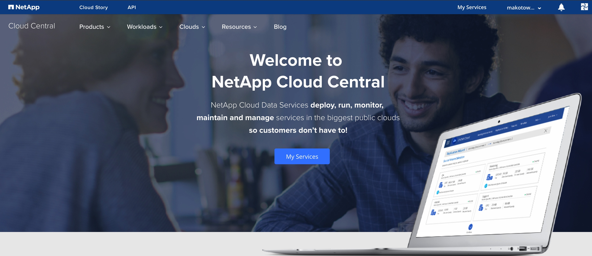

サインアップして、サービス一覧へ。

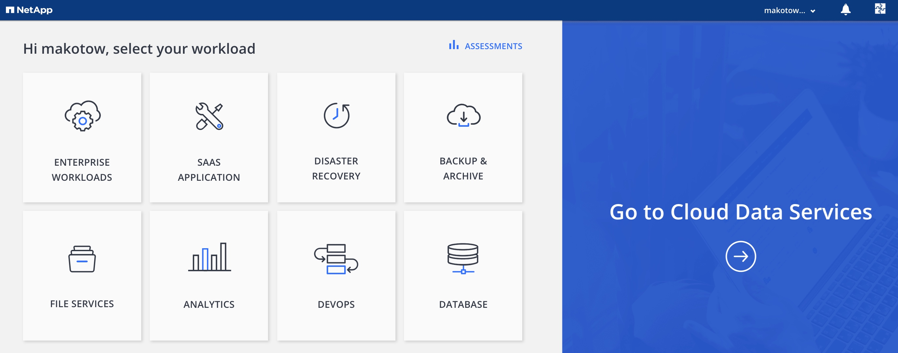

「Go to Cloud Data Services」をクリックして

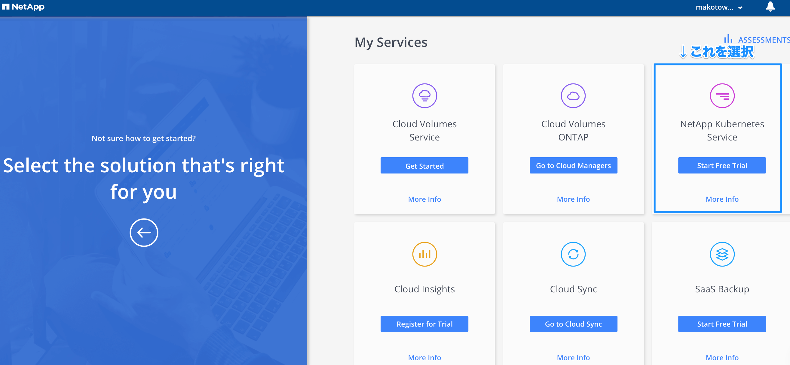

基本オペレーション
===========================================================

約３クリックでkubernetesクラスをある程度のHelm chart入りでデプロイができます。

各種アカウント登録
-----------------------------------------------------------

もちろんデプロイをするには各種クラウドプロバイダのクレデンシャル登録が必要になります。
最初アクセス時に登録を促す画面がでるので適宜登録します。

デプロイメントの流れ
========================================================================

サービス選択
------------------------------------------------------------------------

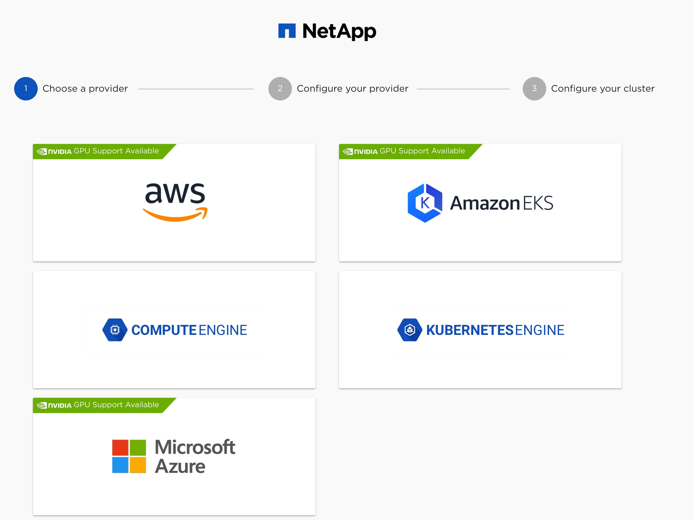

ここではAWSを選択します。
そうすると以下の画面に遷移して、デプロイするマスターノードの数、ワーカーノードの数、ディスクサイズやデプロイするVPCを選択する画面になります。

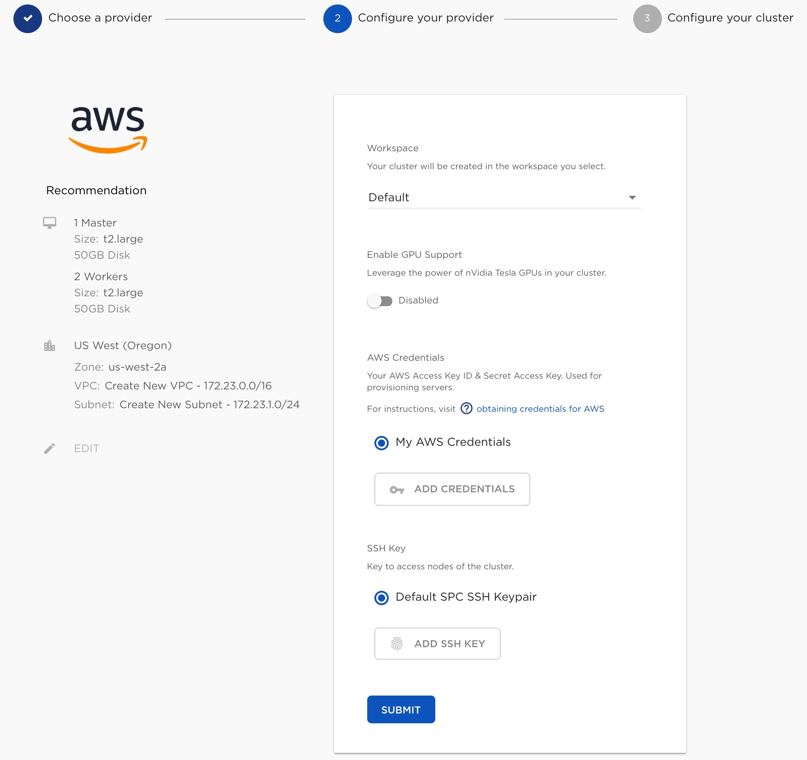

デプロイ先などを選んだら画面したの「Submit」で次の画面へ。

必要な要素を選択(Solutions)
-----------------------------------------------------------

ここまで来るとデプロイまでもうすぐです。
ここではクラスタ名、デプロイするk8sのバージョン、RBACやダッシュボードをインストールするか、Pod/Service　ネットワークのIP指定。

デプロイするk8sを形成するOSなどを選択します。

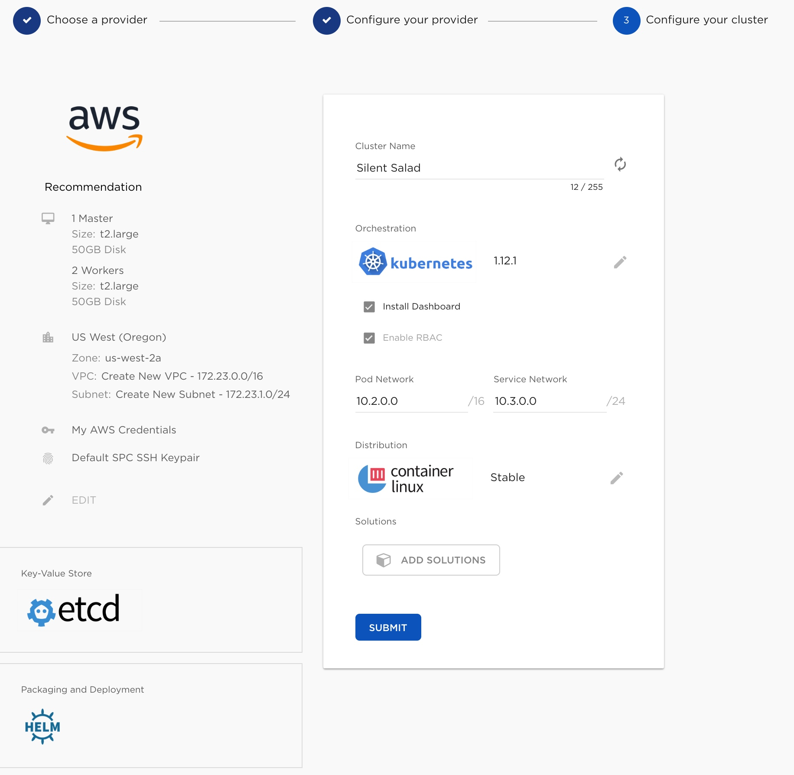

「ADD　SOLUTIONS」というボタンをクリックすると、
デプロイ時に導入するアプリケーションを選択できます。

３つ種類があって事前に導入する予定のHelmChartを選択できます。

- NetApp Container Engine Solution
- Trusted Chart
- My Charts

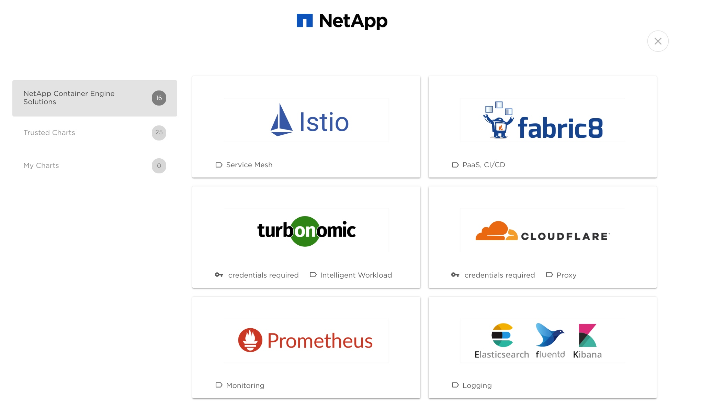

デプロイした時点で Prometheusが稼働していたり、Istioが稼働しているといったものが作れます。

また、 My Chartについては自分たちで準備しているHelm repositoryを登録することができます。

ちなみに Prometheus を追加すると、依存関係のあるHAPROXYも自動で追加してくれます。

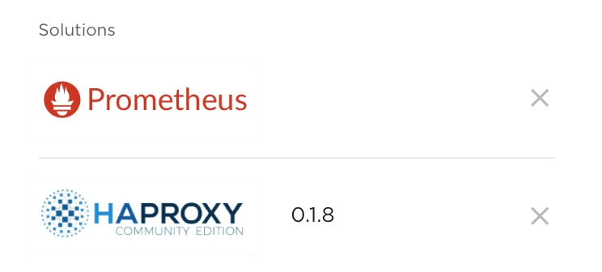

これで画面下の「Submit」をクリックするとデプロイが始まります。
デプロイが完了するとユーザ作成時に登録したメールアドレスにクラスタ作成完了のメールが届きます。

出来上がったクラスタは一覧でみることができます。

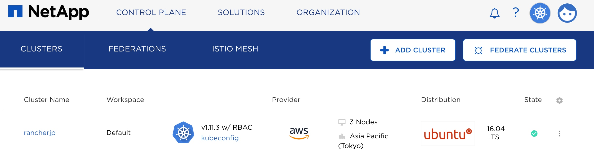

デプロイ後のクラスタに対する操作
===================================================

出来上がったクラスタのクラスタ名をクリックするとクラスタの詳細をみることができます。

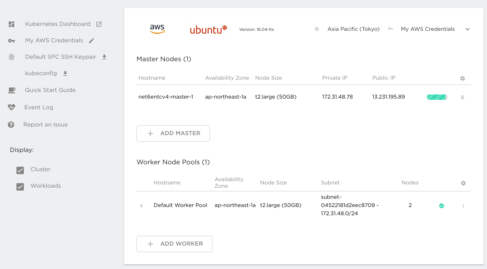

この画面からマスターノードの追加、ワーカーノードの追加、Solutionsの追加ができます。

その他にも現在稼働中のDeploymentを確認することができます。

構成情報のバックアップにも対応しており、同一画面で Heptio Ark の有効化、設定を行うことができます。

直感的になにをするかわかりますが、Heptio 自体がk8sの構成情報をバックアップしてくれます。

この画面では以下のような入力項目を入れると定期的にk8sのバックアップ情報を取得してくれます。

- バックアップしたデータをどこに保存するか？
- どのリージョンに保存するか？
- 頻度はどのくらいか？
- 使うクレデンシャルは？

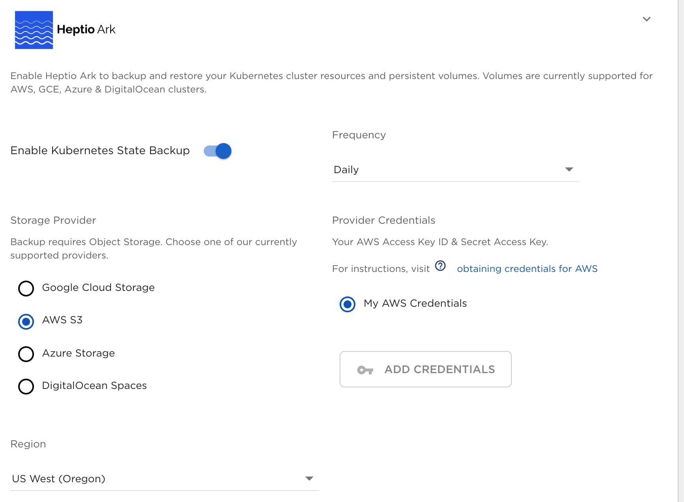

リストアもこの画面から実施することができます。

リストアボタンをクリックすると現状取得しているバックアップの一覧がでてきてここから戻すことができます。

まとめ
===================================================

ここまでNKSの概要となります、次のセクションからは実際の使い方などを記載していきます。
