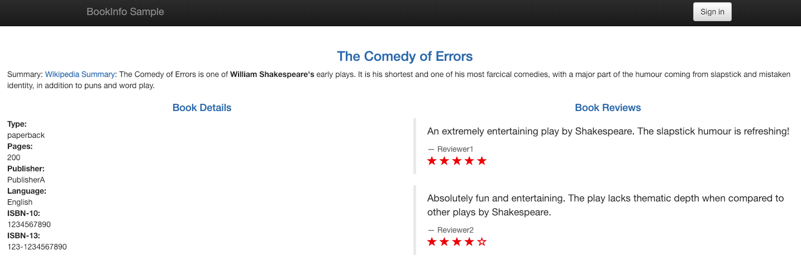
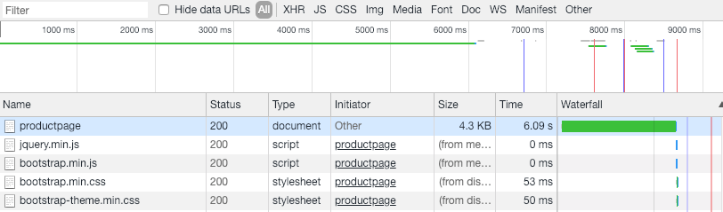

:orphan:

=============================================================
Istio を体験してみる
=============================================================

ここではサービスメッシュの1つの実装であるIstioについて体験していきます。

Istioをインストール時の前提
===============================================================

まずは触れることで理解を深めましょう。
今回は実際にインストールするところとIstioがサイドカーコンテナとして動作するところまでを確認します。

公式の手順にのとおりりインストールをします。

.. code-block:: console

    curl -L https://git.io/getLatestIstio | sh -

ここでは一般的なkubernetes環境を想定しているのと、できる限り推奨をつかいたいのでHelm + pure kubernetesで実施します。

外部公開するためのServiceのTypeですが、本ガイドではLoadBalancerを使う想定で記述しています。
NodePortを使う場合は以下の通り設定可能と記載があるので備忘としてURLと一部文言抜粋しておきます。
NodePortを使いたい人は以下のURLを参照し実施してください。

https://istio.io/docs/setup/kubernetes/helm-install/

.. puill-quote

    Istio by default uses LoadBalancer service object types. Some platforms do not support LoadBalancer service objects. For platforms lacking LoadBalancer support, install Istio with NodePort support instead with the flags — set gateways.istio-ingressgateway.type=NodePort — set gateways.istio-egressgateway.type=NodePort appended to the end of the Helm operation.

インストール済みツールのバージョン確認
--------------------------------------------------

今回試している環境の確認をします。

kubernetes, kubectlのバージョンは以下のとおりです。

.. code-block:: console

    $ kubectl version --short

    Client Version: v1.13.1
    Server Version: v1.12.3

Helmのバージョンを確認します。

.. code-block:: console

    $ helm version

    Client: &version.Version{SemVer:"v2.12.1", GitCommit:"02a47c7249b1fc6d8fd3b94e6b4babf9d818144e", GitTreeState:"clean"}
    Server: &version.Version{SemVer:"v2.12.1", GitCommit:"02a47c7249b1fc6d8fd3b94e6b4babf9d818144e", GitTreeState:"clean"}

クラスタの状況確認
--------------------------------------------------

k8s オブジェクトの稼働状況です。
ここでは後ほどIstioをデプロイした後と比較するためすべての状態を出力しています。

.. code-block:: console

    $ kubectl get all --all-namespaces

    NAMESPACE     NAME                                                                          READY   STATUS    RESTARTS   AGE
    kube-system   pod/coredns-576cbf47c7-8x2bg                                                  1/1     Running   0          8m38s
    kube-system   pod/coredns-576cbf47c7-cr9gc                                                  1/1     Running   0          8m38s
    kube-system   pod/dashboard-proxy-79787b76d4-pqkhj                                          1/1     Running   0          6m44s
    kube-system   pod/heapster-5459947ccc-v9rth                                                 1/1     Running   0          6m45s
    kube-system   pod/kube-apiserver-ip-172-23-1-136.ap-northeast-1.compute.internal            1/1     Running   0          7m57s
    kube-system   pod/kube-controller-manager-ip-172-23-1-136.ap-northeast-1.compute.internal   1/1     Running   0          7m53s
    kube-system   pod/kube-flannel-ds-dd7zz                                                     1/1     Running   0          8m27s
    kube-system   pod/kube-flannel-ds-gbpxk                                                     1/1     Running   0          7m57s
    kube-system   pod/kube-flannel-ds-vcvmf                                                     1/1     Running   1          7m56s
    kube-system   pod/kube-proxy-csnvm                                                          1/1     Running   0          7m56s
    kube-system   pod/kube-proxy-dtsd2                                                          1/1     Running   0          7m57s
    kube-system   pod/kube-proxy-gpc5n                                                          1/1     Running   0          8m38s
    kube-system   pod/kube-scheduler-ip-172-23-1-136.ap-northeast-1.compute.internal            1/1     Running   0          7m56s
    kube-system   pod/kubernetes-dashboard-778d4ccc65-r2s4t                                     1/1     Running   0          6m44s
    kube-system   pod/tiller-deploy-6fb6d4777d-7jrj5                                            1/1     Running   0          7m16s
    NAMESPACE     NAME                           TYPE        CLUSTER-IP   EXTERNAL-IP   PORT(S)         AGE
    default       service/kubernetes             ClusterIP   10.3.0.1     <none>        443/TCP         8m58s
    kube-system   service/heapster               ClusterIP   10.3.0.196   <none>        80/TCP          6m45s
    kube-system   service/kube-dns               ClusterIP   10.3.0.10    <none>        53/UDP,53/TCP   8m53s
    kube-system   service/kubernetes-dashboard   ClusterIP   10.3.0.76    <none>        443/TCP         6m44s
    kube-system   service/tiller-deploy          ClusterIP   10.3.0.28    <none>        44134/TCP       7m16s
    NAMESPACE     NAME                             DESIRED   CURRENT   READY   UP-TO-DATE   AVAILABLE   NODE SELECTOR                   AGE
    kube-system   daemonset.apps/kube-flannel-ds   3         3         3       3            3           beta.kubernetes.io/arch=amd64   8m27s
    kube-system   daemonset.apps/kube-proxy        3         3         3       3            3           <none>                          8m53s
    NAMESPACE     NAME                                   DESIRED   CURRENT   UP-TO-DATE   AVAILABLE   AGE
    kube-system   deployment.apps/coredns                2         2         2            2           8m53s
    kube-system   deployment.apps/dashboard-proxy        1         1         1            1           6m44s
    kube-system   deployment.apps/heapster               1         1         1            1           6m46s
    kube-system   deployment.apps/kubernetes-dashboard   1         1         1            1           6m44s
    kube-system   deployment.apps/tiller-deploy          1         1         1            1           7m16s
    NAMESPACE     NAME                                              DESIRED   CURRENT   READY   AGE
    kube-system   replicaset.apps/coredns-576cbf47c7                2         2         2       8m38s
    kube-system   replicaset.apps/dashboard-proxy-79787b76d4        1         1         1       6m44s
    kube-system   replicaset.apps/heapster-5459947ccc               1         1         1       6m45s
    kube-system   replicaset.apps/kubernetes-dashboard-778d4ccc65   1         1         1       6m44s
    kube-system   replicaset.apps/tiller-deploy-6fb6d4777d          1         1         1       7m16s

Helmを使いIstioをインストール
=================================================================================================

IstioのInstallは上記のページをみて実施します、インストールしたHelmは 2.10.0 以降なので Option1を実施します。

インストール方法は2つあります。

https://istio.io/docs/setup/kubernetes/helm-install/

- Option1: Helm template を使ってデプロイする方法
- Option2: Helm Tiller を使ってデプロイする方式

今回はOption1でマニフェストを生成して実施する方法とOption2のHelmを使ったインストールを記載しました。
やりなれた方法で実施ください。

Service.TypeはLoadBalancerを使用し作成することとします。

LoadBalancerの場合は特にvaluesを指定せずに実行します。

デプロイするマニフェストを生成します。

.. code-block:: console

    $ helm template istio-1.0.6/install/kubernetes/helm/istio --name istio --namespace istio-system > ./manifest/istio.yaml

他にもService.TypeをNodePortで実施する方法もあり、Istioのページから抜粋したものが以下の通りです、基本的には外部公開する箇所をすべてNodePortに変更する方法です。

.. code-block:: console

    $ helm template istio-1.0.6/install/kubernetes/helm/istio --name istio --namespace istio-system --set gateways.istio-ingressgateway.type=NodePort --set gateways.istio-egressgateway.type=NodePort > ./manifest/istio-nodeport.yaml

istioをデプロイするnamespaceを作成します。

.. code-block:: console

    $ kubectl create namespace istio-system

    namespace/istio-system created

上記で生成したマニフェスト投入します。
ログはすべてを表示すると長いのでちょっと長いですが備忘のためすべて記載）

.. code-block:: console

    $ kubectl apply -f manifest/istio.yaml

    configmap/istio-galley-configuration created
    configmap/istio-statsd-prom-bridge created
    configmap/prometheus created
    configmap/istio-security-custom-resources created
    configmap/istio created
    configmap/istio-sidecar-injector created
    serviceaccount/istio-galley-service-account created
    serviceaccount/istio-egressgateway-service-account created
    serviceaccount/istio-ingressgateway-service-account created
    serviceaccount/istio-mixer-service-account created
    serviceaccount/istio-pilot-service-account created
    serviceaccount/prometheus created
    serviceaccount/istio-cleanup-secrets-service-account created
    clusterrole.rbac.authorization.k8s.io/istio-cleanup-secrets-istio-system created
    clusterrolebinding.rbac.authorization.k8s.io/istio-cleanup-secrets-istio-system created
    job.batch/istio-cleanup-secrets created
    serviceaccount/istio-security-post-install-account created
    clusterrole.rbac.authorization.k8s.io/istio-security-post-install-istio-system created
    clusterrolebinding.rbac.authorization.k8s.io/istio-security-post-install-role-binding-istio-system created
    job.batch/istio-security-post-install created
    serviceaccount/istio-citadel-service-account created
    serviceaccount/istio-sidecar-injector-service-account created
    customresourcedefinition.apiextensions.k8s.io/virtualservices.networking.istio.io created
    customresourcedefinition.apiextensions.k8s.io/destinationrules.networking.istio.io created
    customresourcedefinition.apiextensions.k8s.io/serviceentries.networking.istio.io created
    customresourcedefinition.apiextensions.k8s.io/gateways.networking.istio.io created
    customresourcedefinition.apiextensions.k8s.io/envoyfilters.networking.istio.io created
    customresourcedefinition.apiextensions.k8s.io/httpapispecbindings.config.istio.io created
    customresourcedefinition.apiextensions.k8s.io/httpapispecs.config.istio.io created
    customresourcedefinition.apiextensions.k8s.io/quotaspecbindings.config.istio.io created
    customresourcedefinition.apiextensions.k8s.io/quotaspecs.config.istio.io created
    customresourcedefinition.apiextensions.k8s.io/rules.config.istio.io created
    customresourcedefinition.apiextensions.k8s.io/attributemanifests.config.istio.io created
    customresourcedefinition.apiextensions.k8s.io/bypasses.config.istio.io created
    customresourcedefinition.apiextensions.k8s.io/circonuses.config.istio.io created
    customresourcedefinition.apiextensions.k8s.io/deniers.config.istio.io created
    customresourcedefinition.apiextensions.k8s.io/fluentds.config.istio.io created
    customresourcedefinition.apiextensions.k8s.io/kubernetesenvs.config.istio.io created
    customresourcedefinition.apiextensions.k8s.io/listcheckers.config.istio.io created
    customresourcedefinition.apiextensions.k8s.io/memquotas.config.istio.io created
    customresourcedefinition.apiextensions.k8s.io/noops.config.istio.io created
    customresourcedefinition.apiextensions.k8s.io/opas.config.istio.io created
    customresourcedefinition.apiextensions.k8s.io/prometheuses.config.istio.io created
    customresourcedefinition.apiextensions.k8s.io/rbacs.config.istio.io created
    customresourcedefinition.apiextensions.k8s.io/redisquotas.config.istio.io created
    customresourcedefinition.apiextensions.k8s.io/servicecontrols.config.istio.io created
    customresourcedefinition.apiextensions.k8s.io/signalfxs.config.istio.io created
    customresourcedefinition.apiextensions.k8s.io/solarwindses.config.istio.io created
    customresourcedefinition.apiextensions.k8s.io/stackdrivers.config.istio.io created
    customresourcedefinition.apiextensions.k8s.io/statsds.config.istio.io created
    customresourcedefinition.apiextensions.k8s.io/stdios.config.istio.io created
    customresourcedefinition.apiextensions.k8s.io/apikeys.config.istio.io created
    customresourcedefinition.apiextensions.k8s.io/authorizations.config.istio.io created
    customresourcedefinition.apiextensions.k8s.io/checknothings.config.istio.io created
    customresourcedefinition.apiextensions.k8s.io/kuberneteses.config.istio.io created
    customresourcedefinition.apiextensions.k8s.io/listentries.config.istio.io created
    customresourcedefinition.apiextensions.k8s.io/logentries.config.istio.io created
    customresourcedefinition.apiextensions.k8s.io/edges.config.istio.io created
    customresourcedefinition.apiextensions.k8s.io/metrics.config.istio.io created
    customresourcedefinition.apiextensions.k8s.io/quotas.config.istio.io created
    customresourcedefinition.apiextensions.k8s.io/reportnothings.config.istio.io created
    customresourcedefinition.apiextensions.k8s.io/servicecontrolreports.config.istio.io created
    customresourcedefinition.apiextensions.k8s.io/tracespans.config.istio.io created
    customresourcedefinition.apiextensions.k8s.io/rbacconfigs.rbac.istio.io created
    customresourcedefinition.apiextensions.k8s.io/serviceroles.rbac.istio.io created
    customresourcedefinition.apiextensions.k8s.io/servicerolebindings.rbac.istio.io created
    customresourcedefinition.apiextensions.k8s.io/adapters.config.istio.io created
    customresourcedefinition.apiextensions.k8s.io/instances.config.istio.io created
    customresourcedefinition.apiextensions.k8s.io/templates.config.istio.io created
    customresourcedefinition.apiextensions.k8s.io/handlers.config.istio.io created
    clusterrole.rbac.authorization.k8s.io/istio-galley-istio-system created
    clusterrole.rbac.authorization.k8s.io/istio-egressgateway-istio-system created
    clusterrole.rbac.authorization.k8s.io/istio-ingressgateway-istio-system created
    clusterrole.rbac.authorization.k8s.io/istio-mixer-istio-system created
    clusterrole.rbac.authorization.k8s.io/istio-pilot-istio-system created
    clusterrole.rbac.authorization.k8s.io/prometheus-istio-system created
    clusterrole.rbac.authorization.k8s.io/istio-citadel-istio-system created
    clusterrole.rbac.authorization.k8s.io/istio-sidecar-injector-istio-system created
    clusterrolebinding.rbac.authorization.k8s.io/istio-galley-admin-role-binding-istio-system created
    clusterrolebinding.rbac.authorization.k8s.io/istio-egressgateway-istio-system created
    clusterrolebinding.rbac.authorization.k8s.io/istio-ingressgateway-istio-system created
    clusterrolebinding.rbac.authorization.k8s.io/istio-mixer-admin-role-binding-istio-system created
    clusterrolebinding.rbac.authorization.k8s.io/istio-pilot-istio-system created
    clusterrolebinding.rbac.authorization.k8s.io/prometheus-istio-system created
    clusterrolebinding.rbac.authorization.k8s.io/istio-citadel-istio-system created
    clusterrolebinding.rbac.authorization.k8s.io/istio-sidecar-injector-admin-role-binding-istio-system created
    service/istio-galley created
    service/istio-egressgateway created
    service/istio-ingressgateway created
    service/istio-policy created
    service/istio-telemetry created
    service/istio-pilot created
    service/prometheus created
    service/istio-citadel created
    service/istio-sidecar-injector created
    deployment.extensions/istio-galley created
    deployment.extensions/istio-egressgateway created
    deployment.extensions/istio-ingressgateway created
    deployment.extensions/istio-policy created
    deployment.extensions/istio-telemetry created
    deployment.extensions/istio-pilot created
    deployment.extensions/prometheus created
    deployment.extensions/istio-citadel created
    deployment.extensions/istio-sidecar-injector created
    gateway.networking.istio.io/istio-autogenerated-k8s-ingress created
    horizontalpodautoscaler.autoscaling/istio-egressgateway created
    horizontalpodautoscaler.autoscaling/istio-ingressgateway created
    horizontalpodautoscaler.autoscaling/istio-policy created
    horizontalpodautoscaler.autoscaling/istio-telemetry created
    horizontalpodautoscaler.autoscaling/istio-pilot created
    mutatingwebhookconfiguration.admissionregistration.k8s.io/istio-sidecar-injector created
    attributemanifest.config.istio.io/istioproxy created
    attributemanifest.config.istio.io/kubernetes created
    stdio.config.istio.io/handler created
    logentry.config.istio.io/accesslog created
    logentry.config.istio.io/tcpaccesslog created
    rule.config.istio.io/stdio created
    rule.config.istio.io/stdiotcp created
    metric.config.istio.io/requestcount created
    metric.config.istio.io/requestduration created
    metric.config.istio.io/requestsize created
    metric.config.istio.io/responsesize created
    metric.config.istio.io/tcpbytesent created
    metric.config.istio.io/tcpbytereceived created
    prometheus.config.istio.io/handler created
    rule.config.istio.io/promhttp created
    rule.config.istio.io/promtcp created
    kubernetesenv.config.istio.io/handler created
    rule.config.istio.io/kubeattrgenrulerule created
    rule.config.istio.io/tcpkubeattrgenrulerule created
    kubernetes.config.istio.io/attributes created
    destinationrule.networking.istio.io/istio-policy created
    destinationrule.networking.istio.io/istio-telemetry created

デプロイ後の状態を確認します。

.. code-block:: console

    $ kubectl get all -n istio-system

    NAME                                         READY   STATUS      RESTARTS   AGE
    pod/istio-citadel-55cdfdd57c-98sqs           1/1     Running     0          45s
    pod/istio-cleanup-secrets-46wlx              0/1     Completed   0          52s
    pod/istio-egressgateway-7798845f5d-9pcg2     1/1     Running     0          46s
    pod/istio-galley-76bbb946c8-zhl49            1/1     Running     0          46s
    pod/istio-ingressgateway-78c6d8b8d7-xndll    1/1     Running     0          46s
    pod/istio-pilot-5fcb895bff-lw9gq             2/2     Running     0          45s
    pod/istio-policy-7b6cc95d7b-55zn8            2/2     Running     0          46s
    pod/istio-security-post-install-6j4ml        0/1     Completed   0          51s
    pod/istio-sidecar-injector-9c6698858-jrgfr   1/1     Running     0          45s
    pod/istio-telemetry-bfc9ff784-qsx2t          2/2     Running     0          46s
    pod/prometheus-65d6f6b6c-cthjt               1/1     Running     0          45s
    NAME                             TYPE           CLUSTER-IP   EXTERNAL-IP                                                                   PORT(S)                                                                                                                   AGE
    service/istio-citadel            ClusterIP      10.3.0.116   <none>                                                                        8060/TCP,9093/TCP                                                                                                         46s
    service/istio-egressgateway      ClusterIP      10.3.0.199   <none>                                                                        80/TCP,443/TCP                                                                                                            47s
    service/istio-galley             ClusterIP      10.3.0.112   <none>                                                                        443/TCP,9093/TCP                                                                                                          47s
    service/istio-ingressgateway     LoadBalancer   10.3.0.235   aafdd88330c5011e9b0fd0625a0a3aa5-416663906.ap-northeast-1.elb.amazonaws.com   80:31380/TCP,443:31390/TCP,31400:31400/TCP,15011:30988/TCP,8060:31757/TCP,853:32724/TCP,15030:31740/TCP,15031:32228/TCP   47s
    service/istio-pilot              ClusterIP      10.3.0.150   <none>                                                                        15010/TCP,15011/TCP,8080/TCP,9093/TCP                                                                                     46s
    service/istio-policy             ClusterIP      10.3.0.45    <none>                                                                        9091/TCP,15004/TCP,9093/TCP                                                                                               47s
    service/istio-sidecar-injector   ClusterIP      10.3.0.89    <none>                                                                        443/TCP                                                                                                                   46s
    service/istio-telemetry          ClusterIP      10.3.0.73    <none>                                                                        9091/TCP,15004/TCP,9093/TCP,42422/TCP                                                                                     46s
    service/prometheus               ClusterIP      10.3.0.197   <none>                                                                        9090/TCP                                                                                                                  46s
    NAME                                     DESIRED   CURRENT   UP-TO-DATE   AVAILABLE   AGE
    deployment.apps/istio-citadel            1         1         1            1           45s
    deployment.apps/istio-egressgateway      1         1         1            1           46s
    deployment.apps/istio-galley             1         1         1            1           46s
    deployment.apps/istio-ingressgateway     1         1         1            1           46s
    deployment.apps/istio-pilot              1         1         1            1           45s
    deployment.apps/istio-policy             1         1         1            1           46s
    deployment.apps/istio-sidecar-injector   1         1         1            1           45s
    deployment.apps/istio-telemetry          1         1         1            1           46s
    deployment.apps/prometheus               1         1         1            1           45s
    NAME                                               DESIRED   CURRENT   READY   AGE
    replicaset.apps/istio-citadel-55cdfdd57c           1         1         1       45s
    replicaset.apps/istio-egressgateway-7798845f5d     1         1         1       46s
    replicaset.apps/istio-galley-76bbb946c8            1         1         1       46s
    replicaset.apps/istio-ingressgateway-78c6d8b8d7    1         1         1       46s
    replicaset.apps/istio-pilot-5fcb895bff             1         1         1       45s
    replicaset.apps/istio-policy-7b6cc95d7b            1         1         1       46s
    replicaset.apps/istio-sidecar-injector-9c6698858   1         1         1       45s
    replicaset.apps/istio-telemetry-bfc9ff784          1         1         1       46s
    replicaset.apps/prometheus-65d6f6b6c               1         1         1       45s
    NAME                                                       REFERENCE                         TARGETS         MINPODS   MAXPODS   REPLICAS   AGE
    horizontalpodautoscaler.autoscaling/istio-egressgateway    Deployment/istio-egressgateway    <unknown>/80%   1         5         1          45s
    horizontalpodautoscaler.autoscaling/istio-ingressgateway   Deployment/istio-ingressgateway   <unknown>/80%   1         5         1          45s
    horizontalpodautoscaler.autoscaling/istio-pilot            Deployment/istio-pilot            <unknown>/80%   1         5         1          45s
    horizontalpodautoscaler.autoscaling/istio-policy           Deployment/istio-policy           <unknown>/80%   1         5         1          45s
    horizontalpodautoscaler.autoscaling/istio-telemetry        Deployment/istio-telemetry        <unknown>/80%   1         5         1          45s
    NAME                                    COMPLETIONS   DURATION   AGE
    job.batch/istio-cleanup-secrets         1/1           14s        52s
    job.batch/istio-security-post-install   1/1           11s        51s

ここまででIstioインストール完了です。

Option2 は以下の手順です。

.. code-block:: console

    $ kubectl apply -f install/kubernetes/helm/helm-service-account.yaml

    serviceaccount/tiller created
    clusterrolebinding.rbac.authorization.k8s.io/tiller created

helm 初期化、実施状況によってはWarningが発生するかもしれませんがここでは特に処理せず先にすすめます。

.. code-block:: console

    helm init --service-account tiller

    $HELM_HOME has been configured at /Users/makoto/.helm.
    Warning: Tiller is already installed in the cluster.
    (Use --client-only to suppress this message, or --upgrade to upgrade Tiller to the current version.)
    Happy Helming!

Helmを実行してIstioをインストールします。

.. code-block:: console

    $ helm install install/kubernetes/helm/istio --name istio --namespace istio-system

    NAME:   istio
    LAST DEPLOYED: Sun Mar 17 02:41:16 2019
    NAMESPACE: istio-system
    STATUS: DEPLOYED

    RESOURCES:
    ==> v1/ConfigMap
    NAME                             DATA  AGE
    istio                            1     19s
    istio-galley-configuration       1     19s
    istio-security-custom-resources  2     19s
    istio-sidecar-injector           1     19s
    istio-statsd-prom-bridge         1     19s
    prometheus                       1     19s

    ==> v1/Pod(related)
    NAME                                    READY  STATUS             RESTARTS  AGE
    istio-citadel-5bbbc98c6d-j9lwp          0/1    ContainerCreating  0         18s
    istio-egressgateway-77dfd495df-h8v57    1/1    Running            0         18s
    istio-galley-744969c89-6569l            0/1    ContainerCreating  0         18s
    istio-ingressgateway-6bb7555c76-8wxnq   1/1    Running            0         18s
    istio-pilot-6cbbb9bd95-zwbd9            2/2    Running            0         18s
    istio-policy-755477988-x6qvq            2/2    Running            0         18s
    istio-sidecar-injector-856b74c95-mxnkt  0/1    ContainerCreating  0         17s
    istio-telemetry-78f76f9d6-ckjpj         2/2    Running            0         18s
    prometheus-65d6f6b6c-r9786              1/1    Running            0         18s

    ==> v1/Service
    NAME                    TYPE          CLUSTER-IP   EXTERNAL-IP  PORT(S)                                                                                                                  AGE
    istio-citadel           ClusterIP     10.0.1.164   <none>       8060/TCP,9093/TCP                                                                                                        19s
    istio-egressgateway     ClusterIP     10.0.1.99    <none>       80/TCP,443/TCP                                                                                                           19s
    istio-galley            ClusterIP     10.0.15.206  <none>       443/TCP,9093/TCP                                                                                                         19s
    istio-ingressgateway    LoadBalancer  10.0.1.182   <pending>    80:31380/TCP,443:31390/TCP,31400:31400/TCP,15011:30635/TCP,8060:30357/TCP,853:32248/TCP,15030:30238/TCP,15031:30567/TCP  19s
    istio-pilot             ClusterIP     10.0.9.204   <none>       15010/TCP,15011/TCP,8080/TCP,9093/TCP                                                                                    19s
    istio-policy            ClusterIP     10.0.13.1    <none>       9091/TCP,15004/TCP,9093/TCP                                                                                              19s
    istio-sidecar-injector  ClusterIP     10.0.13.126  <none>       443/TCP                                                                                                                  19s
    istio-telemetry         ClusterIP     10.0.8.125   <none>       9091/TCP,15004/TCP,9093/TCP,42422/TCP                                                                                    19s
    prometheus              ClusterIP     10.0.15.133  <none>       9090/TCP                                                                                                                 19s

    ==> v1/ServiceAccount
    NAME                                    SECRETS  AGE
    istio-citadel-service-account           1        19s
    istio-egressgateway-service-account     1        19s
    istio-galley-service-account            1        19s
    istio-ingressgateway-service-account    1        19s
    istio-mixer-service-account             1        19s
    istio-pilot-service-account             1        19s
    istio-security-post-install-account     1        19s
    istio-sidecar-injector-service-account  1        19s
    prometheus                              1        19s

    ==> v1alpha2/attributemanifest
    NAME        AGE
    istioproxy  17s
    kubernetes  17s

    ==> v1alpha2/kubernetes
    NAME        AGE
    attributes  17s

    ==> v1alpha2/kubernetesenv
    NAME     AGE
    handler  17s

    ==> v1alpha2/logentry
    NAME          AGE
    accesslog     17s
    tcpaccesslog  17s

    ==> v1alpha2/metric
    NAME             AGE
    requestcount     16s
    requestduration  16s
    requestsize      16s
    responsesize     16s
    tcpbytereceived  16s
    tcpbytesent      16s

    ==> v1alpha2/prometheus
    NAME     AGE
    handler  16s

    ==> v1alpha2/rule
    NAME                    AGE
    kubeattrgenrulerule     16s
    promhttp                16s
    promtcp                 16s
    stdio                   16s
    stdiotcp                16s
    tcpkubeattrgenrulerule  16s

    ==> v1alpha2/stdio
    NAME     AGE
    handler  16s

    ==> v1alpha3/DestinationRule
    NAME             AGE
    istio-policy     18s
    istio-telemetry  18s

    ==> v1alpha3/Gateway
    NAME                             AGE
    istio-autogenerated-k8s-ingress  18s

    ==> v1beta1/ClusterRole
    NAME                                      AGE
    istio-citadel-istio-system                19s
    istio-egressgateway-istio-system          19s
    istio-galley-istio-system                 19s
    istio-ingressgateway-istio-system         19s
    istio-mixer-istio-system                  19s
    istio-pilot-istio-system                  19s
    istio-security-post-install-istio-system  19s
    istio-sidecar-injector-istio-system       19s
    prometheus-istio-system                   19s

    ==> v1beta1/ClusterRoleBinding
    NAME                                                    AGE
    istio-citadel-istio-system                              19s
    istio-egressgateway-istio-system                        19s
    istio-galley-admin-role-binding-istio-system            19s
    istio-ingressgateway-istio-system                       19s
    istio-mixer-admin-role-binding-istio-system             19s
    istio-pilot-istio-system                                19s
    istio-security-post-install-role-binding-istio-system   19s
    istio-sidecar-injector-admin-role-binding-istio-system  19s
    prometheus-istio-system                                 19s

    ==> v1beta1/Deployment
    NAME                    READY  UP-TO-DATE  AVAILABLE  AGE
    istio-citadel           0/1    1           0          18s
    istio-egressgateway     1/1    1           1          19s
    istio-galley            0/1    1           0          19s
    istio-ingressgateway    1/1    1           1          19s
    istio-pilot             1/1    1           1          18s
    istio-policy            1/1    1           1          18s
    istio-sidecar-injector  0/1    1           0          18s
    istio-telemetry         1/1    1           1          18s
    prometheus              1/1    1           1          18s

    ==> v1beta1/MutatingWebhookConfiguration
    NAME                    AGE
    istio-sidecar-injector  17s

    ==> v2beta1/HorizontalPodAutoscaler
    NAME                  REFERENCE                        TARGETS        MINPODS  MAXPODS  REPLICAS  AGE
    istio-egressgateway   Deployment/istio-egressgateway   <unknown>/80%  1        5        1         17s
    istio-ingressgateway  Deployment/istio-ingressgateway  <unknown>/80%  1        5        1         17s
    istio-pilot           Deployment/istio-pilot           <unknown>/80%  1        5        1         17s
    istio-policy          Deployment/istio-policy          <unknown>/80%  1        5        1         17s
    istio-telemetry       Deployment/istio-telemetry       <unknown>/80%  1        5        1         17s

サイドカーコンテナのInjetion
=================================================================================================

サービスメッシュ内のPodではIstio互換のサイドカーが動作している状態とします。
Istioサイドカーをpodにインジェクションする方法はistioctlを使って手動で行う方法とistio side car injectorを使って自動で行う方法があります。

kubernetes 1.9 以降の mutating webhook admission controller を使うことで自動Inejectionを行うことができます。
今回は自動Injectionで実施します。なお、インストール時点でMutating webhook admission cotrollerは有効となっています。

Dynamic Admission Controlについては以下のページに記載があります。

Dynamic Admission Control: https://kubernetes.io/docs/reference/access-authn-authz/extensible-admission-controllers/

端的にいうと何かしらのリクエストがあった際にリジェクトしたり、他の操作をすることができるようになります。

サンプルのアプリをデプロイして稼働を確認する
====================================================================================================

Injectは namespaceに付与されているlabelで行われるため、namespace defaultにistio-injection=enabledを付与します。

まず最初にサイドカーをインストールする対象のDeploymentを作成します。

.. code-block:: console

    $ kubectl apply -f istio-1.0.6/samples/sleep/sleep.yaml

    service/sleep created
    deployment.extensions/sleep created

    $ kubectl get pod

    NAME                     READY   STATUS    RESTARTS   AGE
    sleep-86cf99dfd6-xk9b2   1/1     Running   0          5s

Deploymentを作成したnamespaceに対して ``istio-injection=enabled`` のラベルを付与します。

.. code-block:: console

    $ kubectl label namespace default istio-injection=enabled

    namespace/default labeled

    $ kubectl get ns -L istio-injection

    NAME                STATUS   AGE    ISTIO-INJECTION
    default             Active   2d7h   enabled
    istio-system        Active   8h
    kube-public         Active   2d7h
    kube-system         Active   2d7h
    stackpoint-system   Active   2d7h

InjectionはPodの作成時に行われるためポッドを削除し、1/1 Ready → 2/2 Readyになることを確認します。

まずは削除を実施します。その後自動起動してくるところを確認します。

.. code-block:: console

    $ kubectl delete pod sleep-86cf99dfd6-xk9b2　※ Pod名は環境ごとに異なるので各自調べてください。

    pod "sleep-86cf99dfd6-xk9b2" deleted

しばらくするとPod Status は2/2になり、サービスを提供するコンテナとサイドカーコンテナが起動していることが確認できます。

.. code-block:: console

    $ kubectl get pod

    NAME                     READY   STATUS    RESTARTS   AGE
    sleep-86cf99dfd6-xfvmk   2/2     Running   0          37s

    $ kubectl describe pod

    Name:               sleep-86cf99dfd6-xfvmk
    Namespace:          default
    Priority:           0
    PriorityClassName:  <none>
    Node:               ip-172-23-1-146.ap-northeast-1.compute.internal/172.23.1.146
    Start Time:         Mon, 31 Dec 2018 00:00:55 +0900
    Labels:             app=sleep
                        pod-template-hash=86cf99dfd6
    Annotations:        sidecar.istio.io/status:
                          {"version":"50128f63e7b050c58e1cdce95b577358054109ad2aff4bc4995158c06924a43b","initContainers":["istio-init"],"containers":["istio-proxy"]...
    Status:             Running
    IP:                 10.2.1.11
    Controlled By:      ReplicaSet/sleep-86cf99dfd6
    Init Containers:
      istio-init:
        Container ID:  docker://a874daeb8d09930c01d647f2c6a911f6b74648a770b021fa7d89a486d90c3f9f
        Image:         docker.io/istio/proxy_init:1.0.5
        Image ID:      docker-pullable://istio/proxy_init@sha256:6acdf7ffa6b6615b3fd79028220f0550f705d03ba97b66126e0990639a9f3593
        Port:          <none>
        Host Port:     <none>
        Args:
          -p
          15001
          -u
          1337
          -m
          REDIRECT
          -i
          *
          -x
          -b
          -d
        State:          Terminated
          Reason:       Completed
          Exit Code:    0
          Started:      Mon, 31 Dec 2018 00:01:02 +0900
          Finished:     Mon, 31 Dec 2018 00:01:02 +0900
        Ready:          True
        Restart Count:  0
        Environment:    <none>
        Mounts:         <none>
    Containers:
      sleep:
        Container ID:  docker://8f4c3a7985af36fcbb18d90ab8c4ae4c0189909e7f9b4bd2e51ef89c0a2e8772
        Image:         pstauffer/curl
        Image ID:      docker-pullable://pstauffer/curl@sha256:2663156457abb72d269eb19fe53c2d49e2e4a9fdcb9fa8f082d0282d82eb8e42
        Port:          <none>
        Host Port:     <none>
        Command:
          /bin/sleep
          3650d
        State:          Running
          Started:      Mon, 31 Dec 2018 00:01:03 +0900
        Ready:          True
        Restart Count:  0
        Environment:    <none>
        Mounts:
          /var/run/secrets/kubernetes.io/serviceaccount from default-token-hq47k (ro)
      istio-proxy:
        Container ID:  docker://694b7be9a038ec0f572ab540052e9141ea9964fe6bacb7f644c3ed5a0d543d82
        Image:         docker.io/istio/proxyv2:1.0.5
        Image ID:      docker-pullable://istio/proxyv2@sha256:8b7d549100638a3697886e549c149fb588800861de8c83605557a9b4b20343d4
        Port:          15090/TCP
        Host Port:     0/TCP
        Args:
          proxy
          sidecar
          --configPath
          /etc/istio/proxy
          --binaryPath
          /usr/local/bin/envoy
          --serviceCluster
          sleep
          --drainDuration
          45s
          --parentShutdownDuration
          1m0s
          --discoveryAddress
          istio-pilot.istio-system:15007
          --discoveryRefreshDelay
          1s
          --zipkinAddress
          zipkin.istio-system:9411
          --connectTimeout
          10s
          --proxyAdminPort
          15000
          --controlPlaneAuthPolicy
          NONE
        State:          Running
          Started:      Mon, 31 Dec 2018 00:01:03 +0900
        Ready:          True
        Restart Count:  0
        Requests:
          cpu:  10m
        Environment:
          POD_NAME:                      sleep-86cf99dfd6-xfvmk (v1:metadata.name)
          POD_NAMESPACE:                 default (v1:metadata.namespace)
          INSTANCE_IP:                    (v1:status.podIP)
          ISTIO_META_POD_NAME:           sleep-86cf99dfd6-xfvmk (v1:metadata.name)
          ISTIO_META_INTERCEPTION_MODE:  REDIRECT
          ISTIO_METAJSON_LABELS:         {"app":"sleep","pod-template-hash":"86cf99dfd6"}
        Mounts:
          /etc/certs/ from istio-certs (ro)
          /etc/istio/proxy from istio-envoy (rw)
    Conditions:
      Type              Status
      Initialized       True
      Ready             True
      ContainersReady   True
      PodScheduled      True
    Volumes:
      default-token-hq47k:
        Type:        Secret (a volume populated by a Secret)
        SecretName:  default-token-hq47k
        Optional:    false
      istio-envoy:
        Type:    EmptyDir (a temporary directory that shares a pod's lifetime)
        Medium:  Memory
      istio-certs:
        Type:        Secret (a volume populated by a Secret)
        SecretName:  istio.default
        Optional:    true
    QoS Class:       Burstable
    Node-Selectors:  <none>
    Tolerations:     node.kubernetes.io/not-ready:NoExecute for 300s
                     node.kubernetes.io/unreachable:NoExecute for 300s
    Events:
      Type    Reason     Age    From                                                      Message
      ----    ------     ----   ----                                                      -------
      Normal  Scheduled  4m46s  default-scheduler                                         Successfully assigned default/sleep-86cf99dfd6-xfvmk to ip-172-23-1-146.ap-northeast-1.compute.internal
      Normal  Pulling    4m44s  kubelet, ip-172-23-1-146.ap-northeast-1.compute.internal  pulling image "docker.io/istio/proxy_init:1.0.5"
      Normal  Pulled     4m39s  kubelet, ip-172-23-1-146.ap-northeast-1.compute.internal  Successfully pulled image "docker.io/istio/proxy_init:1.0.5"
      Normal  Created    4m39s  kubelet, ip-172-23-1-146.ap-northeast-1.compute.internal  Created container
      Normal  Started    4m39s  kubelet, ip-172-23-1-146.ap-northeast-1.compute.internal  Started container
      Normal  Pulled     4m38s  kubelet, ip-172-23-1-146.ap-northeast-1.compute.internal  Container image "pstauffer/curl" already present on machine
      Normal  Created    4m38s  kubelet, ip-172-23-1-146.ap-northeast-1.compute.internal  Created container
      Normal  Started    4m38s  kubelet, ip-172-23-1-146.ap-northeast-1.compute.internal  Started container
      Normal  Pulled     4m38s  kubelet, ip-172-23-1-146.ap-northeast-1.compute.internal  Container image "docker.io/istio/proxyv2:1.0.5" already present on machine
      Normal  Created    4m38s  kubelet, ip-172-23-1-146.ap-northeast-1.compute.internal  Created container
      Normal  Started    4m38s  kubelet, ip-172-23-1-146.ap-northeast-1.compute.internal  Started container

IstioのTraffic Managementを体験
========================================================================================================

Istio-proxyがコンテナとして稼働していることが確認できました。

MutatingWebhookConfigurationを使うことでnamespaceに付与されているLabelをみて istio-injection=enabled が自動でWebhookを稼働するという動きになります。
既存のコンテナに変更を加えることなく実現することができることを確認できました。

.. todo:: IstioのFault Injectionを使ったテスタビリティの向上

ここからはIstioが提供しているサンプルアプリケーションを使って ``Traffic management`` について体験します。

サンプルアプリケーションのデプロイ
========================================================================================================

https://istio.io/docs/examples/bookinfo/

上記のURLのサンプルのBook info applicationをデプロイしていきます。

事前に設定したAutomatic side car injectionを使いサイドカーコンテナをデプロイします。

.. code-block:: console

    $ kubectl apply -f istio-1.0.6/samples/bookinfo/platform/kube/bookinfo.yaml

    service/details created
    deployment.extensions/details-v1 created
    service/ratings created
    deployment.extensions/ratings-v1 created
    service/reviews created
    deployment.extensions/reviews-v1 created
    deployment.extensions/reviews-v2 created
    deployment.extensions/reviews-v3 created
    service/productpage created
    deployment.extensions/productpage-v1 created

サンプルアプリケーションのデプロイ内容を確認します。

ここではPodで複数のアプリケーションの複数のバージョンがデプロイされていることを確認ください。

.. code-block:: console

    $ kubectl get all

    NAME                                READY   STATUS    RESTARTS   AGE
    pod/details-v1-876bf485f-5l7z5      2/2     Running   0          72s
    pod/productpage-v1-8d69b45c-6f6dj   2/2     Running   0          72s
    pod/ratings-v1-7c9949d479-8vnsm     2/2     Running   0          72s
    pod/reviews-v1-85b7d84c56-jgf6h     2/2     Running   0          72s
    pod/reviews-v2-cbd94c99b-n4mxs      2/2     Running   0          72s
    pod/reviews-v3-748456d47b-r42m5     2/2     Running   0          72s
    pod/sleep-86cf99dfd6-xfvmk          2/2     Running   0          25m

    NAME                  TYPE        CLUSTER-IP   EXTERNAL-IP   PORT(S)    AGE
    service/details       ClusterIP   10.3.0.124   <none>        9080/TCP   72s
    service/kubernetes    ClusterIP   10.3.0.1     <none>        443/TCP    2d8h
    service/productpage   ClusterIP   10.3.0.103   <none>        9080/TCP   72s
    service/ratings       ClusterIP   10.3.0.96    <none>        9080/TCP   72s
    service/reviews       ClusterIP   10.3.0.238   <none>        9080/TCP   72s
    service/sleep         ClusterIP   10.3.0.154   <none>        80/TCP     30m

    NAME                             DESIRED   CURRENT   UP-TO-DATE   AVAILABLE   AGE
    deployment.apps/details-v1       1         1         1            1           72s
    deployment.apps/productpage-v1   1         1         1            1           72s
    deployment.apps/ratings-v1       1         1         1            1           72s
    deployment.apps/reviews-v1       1         1         1            1           72s
    deployment.apps/reviews-v2       1         1         1            1           72s
    deployment.apps/reviews-v3       1         1         1            1           72s
    deployment.apps/sleep            1         1         1            1           30m

    NAME                                      DESIRED   CURRENT   READY   AGE
    replicaset.apps/details-v1-876bf485f      1         1         1       72s
    replicaset.apps/productpage-v1-8d69b45c   1         1         1       72s
    replicaset.apps/ratings-v1-7c9949d479     1         1         1       72s
    replicaset.apps/reviews-v1-85b7d84c56     1         1         1       72s
    replicaset.apps/reviews-v2-cbd94c99b      1         1         1       72s
    replicaset.apps/reviews-v3-748456d47b     1         1         1       72s
    replicaset.apps/sleep-86cf99dfd6          1         1         1       30m

ServiceはClusterIPだけでデプロイされているため外部からアクセスする方法が必要になります。

ここでは ``Istio Gateway`` を使用します。

.. code-block:: console

    $ kubectl apply -f istio-1.0.6/samples/bookinfo/networking/bookinfo-gateway.yaml

    gateway.networking.istio.io/bookinfo-gateway created
    virtualservice.networking.istio.io/bookinfo created

gateway を確認します。

.. code-block:: console

    $ kubectl get gateway

    NAME               AGE
    bookinfo-gateway   25s

払い出されたLoadBalancerのURLを使ってアクセスします。

- http://{bookappsurl}/productpage

以下の画面が出ればデプロイメント完了です。

gatewayとvirtualserviceの内容を見るとどのようなことが実現できるかわかりやすくなっています。

.. code-block:: console

    $ kubectl get gateway bookinfo-gateway -o yaml

    apiVersion: networking.istio.io/v1alpha3
    kind: Gateway
    metadata:
      annotations:
        kubectl.kubernetes.io/last-applied-configuration: |
          {"apiVersion":"networking.istio.io/v1alpha3","kind":"Gateway","metadata":{"annotations":{},"name":"bookinfo-gateway","namespace":"default"},"spec":{"selector":{"istio":"ingressgateway"},"servers":[{"hosts":["*"],"port":{"name":"http","number":80,"protocol":"HTTP"}}]}}
      creationTimestamp: "2018-12-30T16:37:06Z"
      generation: 1
      name: bookinfo-gateway
      namespace: default
      resourceVersion: "6129"
      selfLink: /apis/networking.istio.io/v1alpha3/namespaces/default/gateways/bookinfo-gateway
      uid: 24c1ecbc-0c51-11e9-b0fd-0625a0a3aa5a
    spec:
      selector:
        istio: ingressgateway
      servers:
      - hosts:
        - '*'
        port:
          name: http
          number: 80
          protocol: HTTP

.. code-block:: console

    $ kubectl get virtualservice -o yaml

    apiVersion: v1
    items:
    - apiVersion: networking.istio.io/v1alpha3
      kind: VirtualService
      metadata:
        annotations:
          kubectl.kubernetes.io/last-applied-configuration: |
            {"apiVersion":"networking.istio.io/v1alpha3","kind":"VirtualService","metadata":{"annotations":{},"name":"bookinfo","namespace":"default"},"spec":{"gateways":["bookinfo-gateway"],"hosts":["*"],"http":[{"match":[{"uri":{"exact":"/productpage"}},{"uri":{"exact":"/login"}},{"uri":{"exact":"/logout"}},{"uri":{"prefix":"/api/v1/products"}}],"route":[{"destination":{"host":"productpage","port":{"number":9080}}}]}]}}
        creationTimestamp: "2018-12-30T16:37:06Z"
        generation: 1
        name: bookinfo
        namespace: default
        resourceVersion: "6130"
        selfLink: /apis/networking.istio.io/v1alpha3/namespaces/default/virtualservices/bookinfo
        uid: 24cbe4b1-0c51-11e9-b0fd-0625a0a3aa5a
      spec:
        gateways:
        - bookinfo-gateway
        hosts:
        - '*'
        http:
        - match:
          - uri:
              exact: /productpage
          - uri:
              exact: /login
          - uri:
              exact: /logout
          - uri:
              prefix: /api/v1/products
          route:
          - destination:
              host: productpage
              port:
                number: 9080
    kind: List
    metadata:
      resourceVersion: ""
      selfLink: ""

何回かリロードすると別バージョンの画面が表示されるような動きとなります。

Destination Rule を創る
========================================================================================================

サンプルに含まれているDestinationRuleを作成します。

.. code-block:: console

    $ kubectl apply -f istio-1.0.6/samples/bookinfo/networking/destination-rule-all.yaml

    destinationrule.networking.istio.io/productpage created
    destinationrule.networking.istio.io/reviews created
    destinationrule.networking.istio.io/ratings created
    destinationrule.networking.istio.io/details created

作成した結果を確認します。

.. code-block:: console

    $ kubectl get destinationrules -o yaml

    apiVersion: v1
    items:
    - apiVersion: networking.istio.io/v1alpha3
      kind: DestinationRule
      metadata:
        annotations:
          kubectl.kubernetes.io/last-applied-configuration: |
            {"apiVersion":"networking.istio.io/v1alpha3","kind":"DestinationRule","metadata":{"annotations":{},"name":"details","namespace":"default"},"spec":{"host":"details","subsets":[{"labels":{"version":"v1"},"name":"v1"},{"labels":{"version":"v2"},"name":"v2"}]}}
        creationTimestamp: "2018-12-30T17:24:11Z"
        generation: 1
        name: details
        namespace: default
        resourceVersion: "10716"
        selfLink: /apis/networking.istio.io/v1alpha3/namespaces/default/destinationrules/details
        uid: b8e2036f-0c57-11e9-b0fd-0625a0a3aa5a
      spec:
        host: details
        subsets:
        - labels:
            version: v1
          name: v1
        - labels:
            version: v2
          name: v2
    - apiVersion: networking.istio.io/v1alpha3
      kind: DestinationRule
      metadata:
        annotations:
          kubectl.kubernetes.io/last-applied-configuration: |
            {"apiVersion":"networking.istio.io/v1alpha3","kind":"DestinationRule","metadata":{"annotations":{},"name":"productpage","namespace":"default"},"spec":{"host":"productpage","subsets":[{"labels":{"version":"v1"},"name":"v1"}]}}
        creationTimestamp: "2018-12-30T17:24:11Z"
        generation: 1
        name: productpage
        namespace: default
        resourceVersion: "10712"
        selfLink: /apis/networking.istio.io/v1alpha3/namespaces/default/destinationrules/productpage
        uid: b8c4ffa0-0c57-11e9-b0fd-0625a0a3aa5a
      spec:
        host: productpage
        subsets:
        - labels:
            version: v1
          name: v1
    - apiVersion: networking.istio.io/v1alpha3
      kind: DestinationRule
      metadata:
        annotations:
          kubectl.kubernetes.io/last-applied-configuration: |
            {"apiVersion":"networking.istio.io/v1alpha3","kind":"DestinationRule","metadata":{"annotations":{},"name":"ratings","namespace":"default"},"spec":{"host":"ratings","subsets":[{"labels":{"version":"v1"},"name":"v1"},{"labels":{"version":"v2"},"name":"v2"},{"labels":{"version":"v2-mysql"},"name":"v2-mysql"},{"labels":{"version":"v2-mysql-vm"},"name":"v2-mysql-vm"}]}}
        creationTimestamp: "2018-12-30T17:24:11Z"
        generation: 1
        name: ratings
        namespace: default
        resourceVersion: "10715"
        selfLink: /apis/networking.istio.io/v1alpha3/namespaces/default/destinationrules/ratings
        uid: b8d8fa1b-0c57-11e9-b0fd-0625a0a3aa5a
      spec:
        host: ratings
        subsets:
        - labels:
            version: v1
          name: v1
        - labels:
            version: v2
          name: v2
        - labels:
            version: v2-mysql
          name: v2-mysql
        - labels:
            version: v2-mysql-vm
          name: v2-mysql-vm
    - apiVersion: networking.istio.io/v1alpha3
      kind: DestinationRule
      metadata:
        annotations:
          kubectl.kubernetes.io/last-applied-configuration: |
            {"apiVersion":"networking.istio.io/v1alpha3","kind":"DestinationRule","metadata":{"annotations":{},"name":"reviews","namespace":"default"},"spec":{"host":"reviews","subsets":[{"labels":{"version":"v1"},"name":"v1"},{"labels":{"version":"v2"},"name":"v2"},{"labels":{"version":"v3"},"name":"v3"}]}}
        creationTimestamp: "2018-12-30T17:24:11Z"
        generation: 1
        name: reviews
        namespace: default
        resourceVersion: "10714"
        selfLink: /apis/networking.istio.io/v1alpha3/namespaces/default/destinationrules/reviews
        uid: b8cf6682-0c57-11e9-b0fd-0625a0a3aa5a
      spec:
        host: reviews
        subsets:
        - labels:
            version: v1
          name: v1
        - labels:
            version: v2
          name: v2
        - labels:
            version: v3
          name: v3
    kind: List
    metadata:
      resourceVersion: ""
      selfLink: ""

Intelligent Routing を体験する
====================================================================

ここではIstioが持つ３つの機能を体験します。
それぞれ機能ごとに試してきます、機能については簡単に後ほど説明がでてきます。

1. Request Routing
2. Fault Injection
3. Trafffic Shifting

Request Routing
-------------------------------------------------------------------

ここで試すマニフェストを実行するとv1のページにしかアクセスができなくなります。

.. code-block:: console

    $ kubectl apply -f istio-1.0.6/samples/bookinfo/networking/virtual-service-all-v1.yaml

    virtualservice.networking.istio.io/productpage created
    virtualservice.networking.istio.io/reviews created
    virtualservice.networking.istio.io/ratings created

実行したマニフェストファイルを確認しておきましょう。

.. code-block:: yaml

    apiVersion: networking.istio.io/v1alpha3
    kind: VirtualService
    metadata:
      name: productpage
    spec:
      hosts:
      - productpage
      http:
      - route:
        - destination:
            host: productpage
            subset: v1
    ---
    apiVersion: networking.istio.io/v1alpha3
    kind: VirtualService
    metadata:
      name: reviews
    spec:
      hosts:
      - reviews
      http:
      - route:
        - destination:
            host: reviews
            subset: v1
    ---
    apiVersion: networking.istio.io/v1alpha3
    kind: VirtualService
    metadata:
      name: ratings
    spec:
      hosts:
      - ratings
      http:
      - route:
        - destination:
            host: ratings
            subset: v1
    ---
    apiVersion: networking.istio.io/v1alpha3
    kind: VirtualService
    metadata:
      name: details
    spec:
      hosts:
      - details
      http:
      - route:
        - destination:
            host: details
            subset: v1
    ---

特定ユーザのルーティングも実現できます。

jason ユーザでログイン(パスワードなし）するとv2 黒星のレーティングシステムにルーティングされます。

.. code-block:: console

    $ kubectl apply -f istio-1.0.6/samples/bookinfo/networking/virtual-service-reviews-test-v2.yaml

    virtualservice.networking.istio.io/reviews configured

ここでは実行したマニフェストを各自確認してみましょう。

ここまで来たら後続の体験をするためクリーンアップをします。

.. code-block:: console

    $ kubectl delete -f istio-1.0.6/samples/bookinfo/networking/virtual-service-all-v1.yaml

    virtualservice.networking.istio.io "productpage" deleted
    virtualservice.networking.istio.io "reviews" deleted
    virtualservice.networking.istio.io "ratings" deleted
    virtualservice.networking.istio.io "details" deleted

Fualt Injection
-------------------------------------------------------------------

マイクロサービス間のタイムアウトなどのテストを簡易化する方法として``Fault Injection`` が存在します。
コンポーネント間のやりとりが多くなるためその間でエラー等が発生し、接続できない場合のテストが容易になります。

Bookappsマイクロサービスをjasonユーザでログインしたときのみreview:v2 と ratingsの間で7sec の遅延を入れる。

.. code-block:: console

    $ kubectl apply -f istio-1.0.6/samples/bookinfo/networking/virtual-service-ratings-test-delay.yaml

    virtualservice.networking.istio.io/ratings configured

マニフェスト実行後はエラーがとなることが期待する動作となります。

ChromeのDeveloperツールで見るとページのロードを開始するまで6秒ほどかかっているのがわかります。
先程の7secという指定は全体で7secぐらいという感覚で使うのがよいということがわかりました。

さらに１つサンプルとしてHTTPリターンコードを変更する方法を体験します。

jason ユーザでログインした場合、100% HTTP Status 500 を返すという設定です。
ここでもマニフェストの内容は各自確認してみてください。

.. code-block:: console

    $ kubectl apply -f istio-1.0.6/samples/bookinfo/networking/virtual-service-ratings-test-abort.yaml

    virtualservice.networking.istio.io/ratings configured

jasonでログインし、HTTP 500 がリターンされることを確認しましょう。

Traffic Shifting
---------------------------------------------------------------------

トラフィックを段階的に別のバージョン振り分けていく方法です。
比率を設定することでバージョンごとに振り分けられる比率を変更しています。

こちらもマニフェストは各自確認し、意味を理解しましょう。

.. code-block:: console

    kubectl apply -f istio-1.0.6/samples/bookinfo/networking/virtual-service-reviews-50-v3.yaml

    virtualservice.networking.istio.io/reviews configured

マニフェストの中身です。

.. code-block:: console

    apiVersion: networking.istio.io/v1alpha3
    kind: VirtualService
    metadata:
      name: reviews
    spec:
      hosts:
        - reviews
      http:
      - route:
        - destination:
            host: reviews
            subset: v1
          weight: 50
        - destination:
            host: reviews
            subset: v3
          weight: 50

応用方法
====================================================

ここまででIstioの代表的な機能について体験しました。

ここまでで体験したことで以下のようなことが実現できます。

- A/B テスト
- Blue/Green デプロイ
- Ganary リリース

Level3 で準備したアプリケーションで上記３つのいずれかを実現することにチャレンジしてみましょう。

また、サンプルとして以下のようなジョークアプリケーションも準備しています。

- https://github.com/NetAppJpTechTeam/cowweb

Istio マネージドサービスを使う
====================================================

Level4でも登場したNetApp Kubernetes Service(NKS)を使うと上記のようなオペレーションを管理画面から行うことができます。

現在(2019/3)時点では、AWS、Azure、GCP上にKubernetesクラスタを構成することができ、そのクラスタにIstioのデプロイも同時に可能です。

また、ここまで記載したIntelligent Routing についてもGUIから簡単に操作することができます。

ここからは別ページでNKSを使用した場合のIntelligent Routingについて紹介します。

:doc:`./istio-nks`

