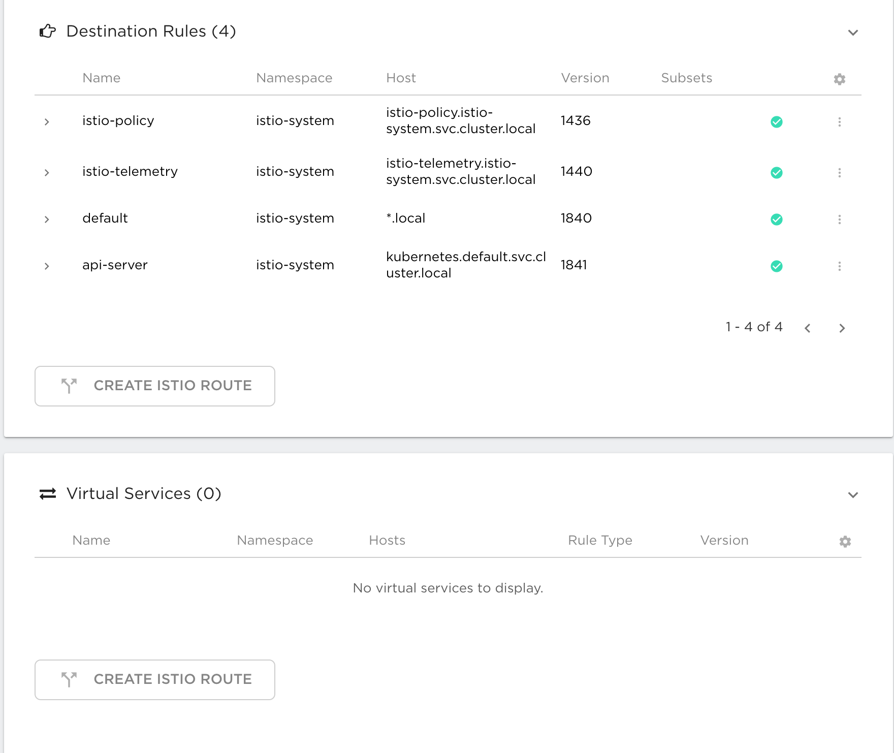
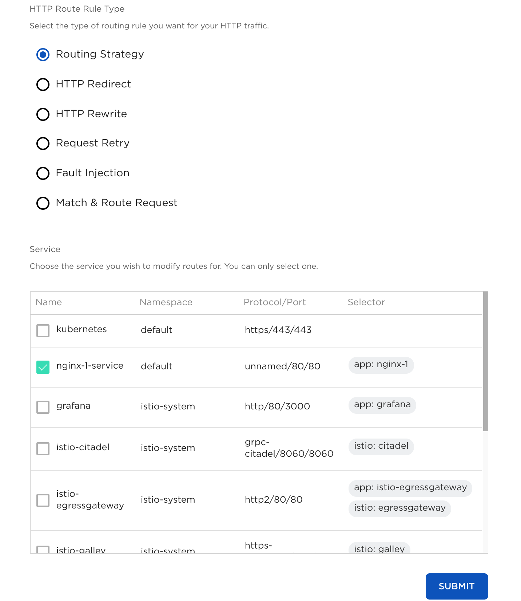
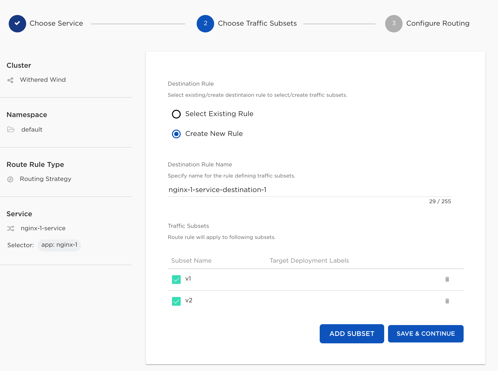
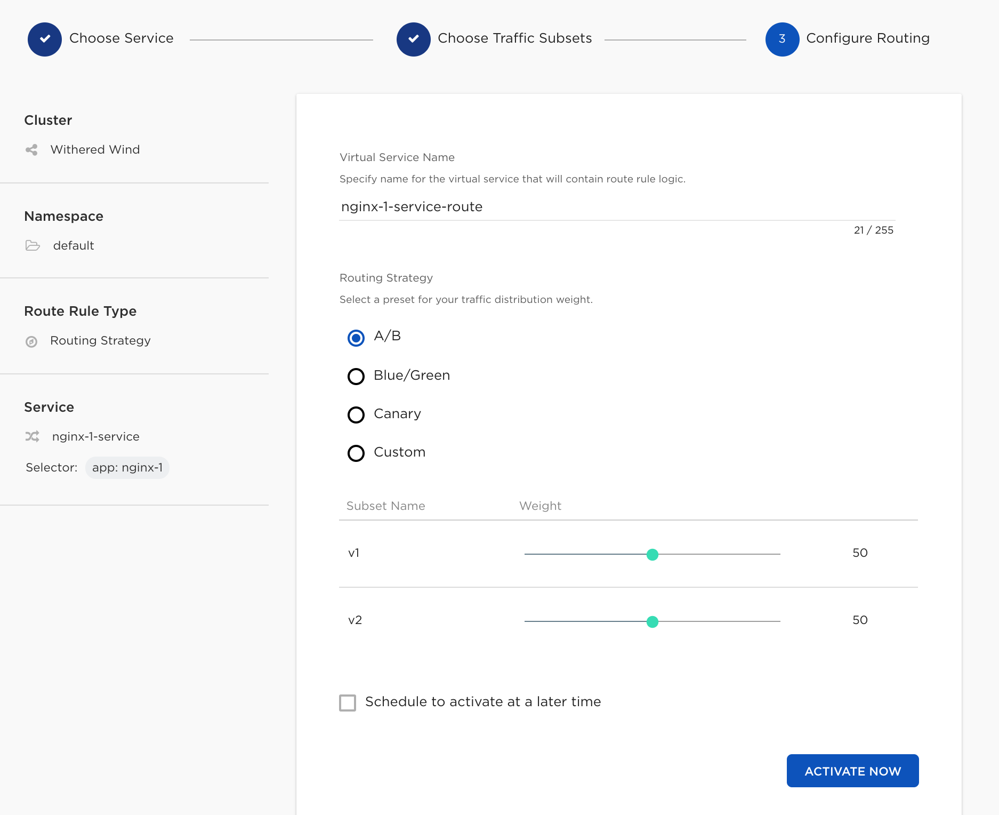
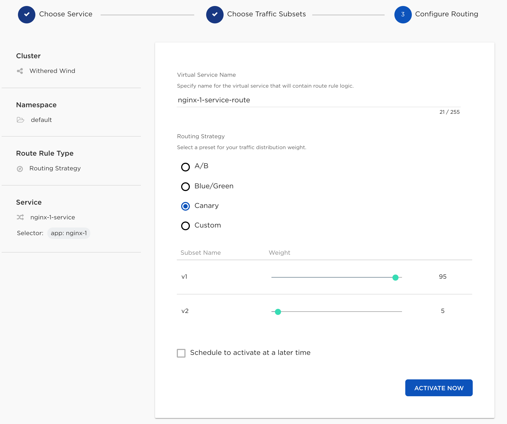
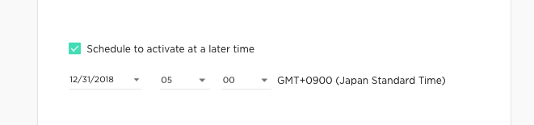

:orphan:

================================================================================
IstioをNKSで構成する
================================================================================

NKSからIstioのIntelligent Routingを実現
====================================================================

事前にLevel4 アプリケーションスタック、Kubernetes スタックの管理 を参照しクラスタをデプロイします。
同時にSolutionsからIstioを導入します。

構成後、クラスタ一覧から対象のクラスタを選択するとServiceMeshを構成できます。

Services, Destionation Rule, Virtual Services の項目が表示されるようになります。

これらの下に「CREATE ISTIO ROUTE」ボタンが表示され、ここからIstioのルーティングが設定できるようになります。

「CREATE ISTIO ROUTE」をクリックするとどのサービスに対してTrafficManagementをするか選択できます。
Submitボタンをクリックし、次の画面へ行きます。

サブセットの設定をする画面となります。
例えば、subsetでv1、v2を準備するとルールとして選択できるようになります。
この画面でルールを創ることもできます。「Save&Continue」で先に進みます。

前の画面で選んだTraffic SubsetではRoute Rule Typeで設定する項目が変わります。
次の画面はRouting Strategyを選択したものです。

ほかにもマニフェストの場合、自分自身で比率等を考え設定しなければいけませんでしたが、
ある程度のテンプレートは準備されており、RoutingStrategyを選ぶことで自動で比率を変更してくれます。

A/Bテストの場合は以下のような比率になり。

Canary リリースの場合は以下のようになり、A/Bテストとは違った比率になっていることが確認できます。

この設定自体は即時変更も可能、かつスケジュールによって変更することも可能です。

スケジュール設定画面は以下の画面が準備されております。

応用編
====================================================================

TrafficManagementと同様にFault Injection, Match&RouteReuestなど他のRuleTypeも試してみましょう。

まとめ
====================================================================

非常に少ないステップでIstioのTrafficManagementを定義刷ることを体験できました。

Istioを直接デプロイ、設定することで中身に対する理解が深まったかと思います。
運用時には複数のプラットフォームで直感的に操作でき一貫した運用をしたいケースもあるかと思います。

その際にはNKSがフィットするのではと考えています。
